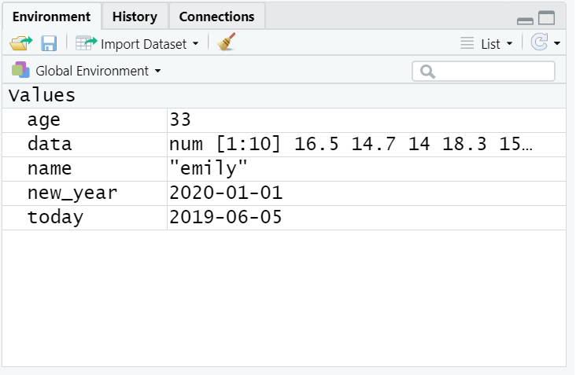
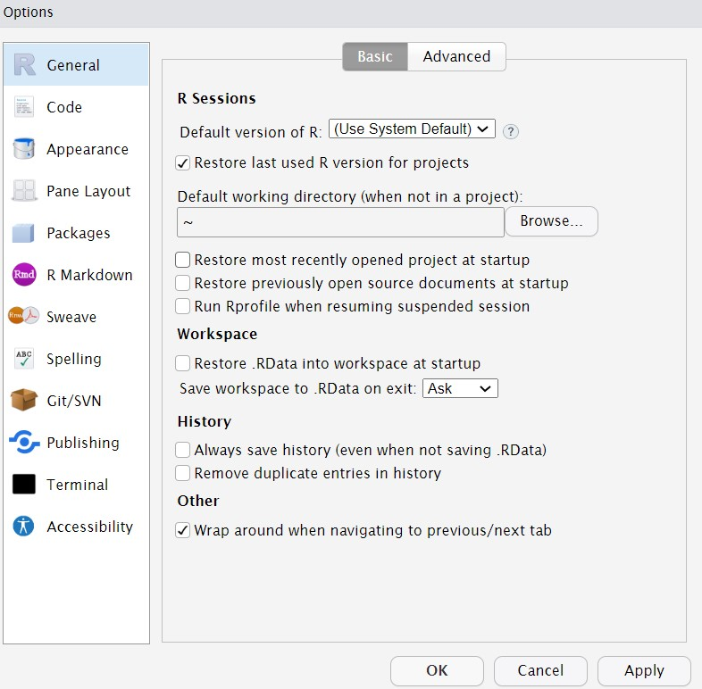

# Programming basics

In this chapter, we will cover how to use R and RStudio at the University of Glasgow as well as some basic programming concepts and terminology, common pitfalls, helpful hints, and where to get help. Those of you who have no programming experience should find this chapter particularly helpful, however, even if you've used R before there may be some helpful hints and tips so please make sure you read through this chapter before the moving on.

This is a long chapter but we don't expect you to memorise all the information that is contained in it and some sections of it will not make sense until you start writing your own code - just make sure you know what help is available!

## R and RStudio

R is a programming language that you will write code in and RStudio is an Integrated Development Environment (IDE) which makes working with R easier. Think of it as knowing English and using a plain text editor like NotePad to write a book versus using a word processor like Microsoft Word. You could do it, but it wouldn't look as good and it would be much harder without things like spell-checking and formatting. In a similar way, you can use R without R Studio but we wouldn't recommend it. The key thing to remember is that although you will do all of your work using RStudio for this course, you are actually using two pieces of software which means that from time-to-time, both of them may have separate updates.

There are two ways you can use R for psychology. First, you can use a online version of R and R through your web browser and we will refer to this as the **R server**. Second, you can download and install R and RStudio for free on your laptop or desktop computer.

**Which version of R should you use?**

The advantage of using the R server is that you do not need to install anything on your machine, you simply access it through your web browser. All  the extra packages and functions you need for this course will already be installed. We recommend using the server if you have a computer that you cannot install R on (e.g., a Chromebook), or if you have serious problems with installing R on your computer. 

The advantage to installing R on your computer is that you do not need to be connected to the internet to use it, it is easier to save and manage your files, and there are no problems caused if the server crashes (which is rare, but does and has happened). 

With the exception of how they save files, both versions are largely identical in how they work, however, after a year over working remotely, we have concluded that **if you can install R on your computer, you should**. If your computer cannot install R, or if you have technical problems during the installation you cannot resolve, then you should use the server. However, the need to be connected to the internet and the inability to open e.g., assessment files directly on your computer if you use the server mean that it is worth trying to install it if you can.    

### R server

You will find the link to the R server on Moodle. Please note that the R server is only for use by students and staff in the School of Psychology and Institute for Neuroscience and Psychology. Sign in to the R server with your usual GUID and password. 

### Installing R on your computer

To use R on your computer, please see [Installing R](https://psyteachr.github.io/ug1-practical/installing-r.html) which has more detailed instructions and links to the files you need to download, as well as a links to a series of walkthroughs for installing R on different types of computers. 

## Getting to know R Studio

R Studio has a console that you can try out code in (appearing as the bottom left window in Figure \@ref(fig:img-rstudio)), there is a script editor (top left), a window showing functions and objects you have created in the “Environment” tab (top right window in the figure), and a window that shows plots, files packages, and help documentation (bottom right).

```{r img-rstudio, echo=FALSE, fig.cap="RStudio interface"}

knitr::include_graphics("images/rstudio.png")

```

You will learn more about how to use the features included in R Studio throughout this course, however, we highly recommend watching [RStudio Essentials 1](https://rstudio.com/resources/webinars/programming-part-1-writing-code-in-rstudio/) from the R Studio team. The video lasts ~30 minutes and gives a tour of the main parts of R Studio. 

## Console vs. scripts

When you first open up R Studio you won't see a script like above, there will just be a single pane on the left, which is the console. You can write code in the console to test it out, but it won't save anywhere. For this chapter, we'll use the console to show you some simple code examples but moving forward you'll save your code in a script file, and you'll see the extra pane appear.

## Functions and arguments

**Functions** in R execute specific tasks and normally take a number of **arguments** (if you're into linguistics you might want to think as these as verbs that require a subject and an object). You can look up all the arguments that a function takes by using the help documentation by using the format `?function`. Some arguments are required, and some are optional. Optional arguments will often use a default (normally specified in the help documentation) if you do not enter any value.

As an example, let’s look at the help documentation for the function `rnorm()` which randomly generates a set of numbers with a normal distribution. 

## Activity 1

* Open up R Studio (either on the server or on your machine) and in the console, type the following code:  

```{r help-doc, eval=FALSE}

?rnorm

```

The help documentation for `rnorm()` should appear in the bottom right help panel. In the usage section, we see that `rnorm()` takes the following form:

```{r arguments, eval = FALSE}
rnorm(n, mean = 0, sd = 1)
```

In the arguments section, there are explanations for each of the arguments. `n` is the number of observations we want to create, `mean` is the mean of the data points we will create and `sd` is the standard deviation of the set. In the details section it notes that if no values are entered for `mean` and `sd` it will use a default of 0 and 1 for these values. Because there is no default value for `n` it must be specified otherwise the code won't run.

Let's try an example and just change the required argument `n` to ask R to produce 5 random numbers. 

## Activity 2

* Copy and paste the following code into the console.  

```{r rnorm-n}
set.seed(12042016)
rnorm(n = 5)
```

These numbers have a mean of 0 and an SD of 1. Now we can change the additional arguments to produce a different set of numbers.

```{r}
rnorm(n = 5, mean = 10, sd = 2)
```

This time R has still produced 5 random numbers, but now this set of numbers has a mean of 10 and an sd of 2 as specified. Always remember to use the help documentation to help you understand what arguments a function requires.


```{block, type="info"}
If you're looking up examples of code online, you may often see code that starts with the function `set.seed()`. This function controls the random number generator - if you're using any functions that generate numbers randomly (such as `rnorm()`), running `set.seed()` will ensure that you get the same result (in some cases this may not be what you want to do). We call `set.seed()` in this example because it means that you will get the same random numbers as this book.
```

## Argument names

In the above examples, we have written out the argument names in our code (e.g., `n`, `mean`, `sd`), however, this is not strictly necessary. The following two lines of code would both produce the same result (although each time you run `rnorm()` it will produce a slightly different set of numbers, because it's random, but they would still have the same mean and SD):

```{r argument-names, eval = FALSE}

rnorm(n = 6, mean = 3, sd = 1)
rnorm(6, 3, 1)

```

Importantly, if you do not write out the argument names, R will use the default order of arguments, that is for `rnorm` it will assume that the first number you enter is `n`. the second number is `mean` and the third number is `sd`. 

If you write out the argument names then you can write the arguments in whatever order you like:

```{r argument-order, eval = FALSE}

rnorm(sd = 1, n = 6, mean = 3)

```

When you are first learning R, you may find it useful to write out the argument names as it can help you remember and understand what each part of the function is doing. However, as your skills progress you may find it quicker to omit the argument names and you will also see examples of code online that do not use argument names so it is important to be able to understand which argument each bit of code is referring to (or look up the help documentation to check).

In this course, we will always write out the argument names the first time we use each function, however, in subsequent uses they may be omitted.

## Tab auto-complete

One very useful feature of R Studio is the tab auto-complete for functions (see Figure \@ref(fig:img-autocomplete)). If you write the name of the function and then press the tab key, R Studio will show you the arguments that function takes along with a brief description. If you press enter on the argument name it will fill in the name for you, just like auto-complete on your phone. This is incredibly useful when you are first learning R and you should remember to use this feature frequently. 

```{r img-autocomplete, echo=FALSE, fig.cap="Tab auto-complete"}

knitr::include_graphics("images/autocomplete.png")

```

## Base R and packages {#packages}

When you install R you will have access to a range of functions including options for data wrangling and statistical analysis. The functions that are included in the default installation are typically referred to as **Base R** and there is a useful cheat sheet that shows many Base R functions [here](https://www.rstudio.com/wp-content/uploads/2016/05/base-r.pdf).

However, the power of R is that it is extendable and open source - put simply, if a function doesn't exist or doesn't work very well, anyone can create a new **package** that contains data and code to allow you to perform new tasks. You may find it useful to think of Base R as the default apps that come on your phone and packages as additional apps that you need to download separately.

## Activity 3: Install the tidyverse (optional)

In order to use a package, you must first install it. The following code installs the package `tidyverse`, a package we will use very frequently in this course.

* If you are working on your own computer, use the below code to install the tidyverse. **You do not need to do this if you are working on the server or if you are using the computers in the Boyd Orr building**.  

```{r install-packages, eval = FALSE}
install.packages("tidyverse")
```

You only need to install a package once, however, each time you start R you need to load the packages you want to use, in a similar way that you need to install an app on your phone once, but you need to open it every time you want to use it.

```{block, type="danger"}

If you get an error message that says something like "WARNING: Rtools is required to build R packages" you may need to download and install an extra bit of software called [Rtools](https://cran.r-project.org/bin/windows/Rtools/) (this is one of the many reasons why using the server can be easier).

```

To load packages we use the function `library()`. Typically you would start any analysis script by loading all of the packages you need, but we will come back to that in the next chapter.

## Activity 4: Load the tidyverse

* Run the below code to load the tidyverse. You can do this regardless of whether you are using your own computer or the server.  

```{r library-load, eval = FALSE}
library(tidyverse)
```

You will get what looks like an error message - it's not. It's just R telling you what it's done.

Now that we've loaded the `tidyverse` package we can use any of the functions it contains but remember, you need to run the `library()` function every time you start R.


## Package updates

In addition to updates to R and R Studio, the creators of packages also sometimes update their code. This can be to add functions to a package, or it can be to fix errors. One thing to avoid is unintentionally updating an installed package. When you run `install.packages()` it will always install the latest version of the package and it will overwrite any older versions you may have installed. Sometimes this isn't a problem, however, sometimes you will find that the update means your code no longer works as the package has changed substantially. It is possible to revert back to an older version of a package but try to avoid this anyway.

```{block, type="danger"}

To avoid accidentally overwriting a package with a later version, you should **never** include `install.packages()` in your analysis scripts in case you, or someone else runs the code by mistake. Remember, the server will already have all of the packages you need for this course so you only need to install packages if you are using your own machine.

```

## Package conflicts {#conflicts}

There are thousands of different R packages with even more functions. Unfortunately, sometimes different packages have the same function names. For example, the packages `dplyr` and `MASS` both have a function named `select()`. If you load both of these packages, R will produce a warning telling you that there is a conflict.

```{r package-conflict}
library(dplyr)
library(MASS)
```

In this case, R is telling you that the function `select()` in the `dplyr` package is being hidden (or 'masked') by another function with the same name. If you were to try and use `select()`, R would use the function from the package that was loaded most recently - in this case it would use the function from `MASS`.

If you want to specify which package you want to use for a particular function you can use code in the format `package::function`, for example:

```{r package-specify, eval=FALSE}
dplyr::select()
MASS::select()
```

## Objects

A large part of your coding will involve creating and manipulating objects. Objects contain stuff. That stuff can be numbers, words, or the result of operations and analyses.You assign content to an object using `<-`.

## Activity 5: Create some objects

* Copy and paste the following code into the console, change the code so that it uses your own name and age and run it. You should see that `name`, `age`, `today`, `new_year`, and `data` appear in the environment pane.  

```{r objects}

name <- "emily"
age <- 16 + 19 
today <-Sys.Date()
new_year <- as.Date("2021-01-01")
data <- rnorm(n = 10, mean = 15, sd = 3)

```

```{r img-objects-enviro, echo=FALSE, fig.cap="Objects in the environment"}



```

Note that in these examples, `name`,`age`, and `new_year` would always contain the values `emily`, `35`, and the date of New Year's Day 2021, however, `today` will draw the date from the operating system and `data` will be a randomly generated set of data so the values of these objects will not be static.

As a side note, if you ever have to teach programming and statistics, don't use your age as an example because every time you have to update your teaching materials you get a reminder of the fragility of existence and your advancing age. 

Importantly, objects can be involved in calculations and can interact with each other. For example:

```{r objects-interact}

age + 10
new_year - today
mean(data)

```

Finally, you can store the result of these operations in a new object:

```{r objects-interact2}

decade <- age + 10

```

```{block, type="try"}
You may find it helpful to read `<-` as `contains`, e.g., `name` contains the text `emily`.
```

You will constantly be creating objects throughout this course and you will learn more about them and how they behave as we go along, however, for now it is enough to understand that they are a way of saving values, that these values can be numbers, text, or the result of operations, and that they can be used in further operations to create new variables.

```{block, type="info"}

You may also see objects referred to as 'variables'. There is a difference between the two in programming terms, however, they are used synonymously very frequently.

```

## Looking after the environment

If you've been writing a lot of code you may find that the environment pane (or workspace) has become cluttered with many objects. This can make it difficult to figure out which object you need and therefore you run the risk of using the wrong data frame. If you're working on a new dataset, or if you've tried lots of different code before getting the final version, it is good practice to remember to clear the environment to avoid using the wrong object. You can do this in several way.

1. To remove individual objects, you can type `rm(object_name)` in the console. Try this now to remove one of the objects you created in the previous section. 
2. To clear all objects from the environment run `rm(list = ls())` in the console.
3. To clear all objects from the environment you can also click the broom icon in the environment pane. 


```{r img-broom, echo=FALSE, fig.cap="Clearing the workspace"}

knitr::include_graphics("images/broom.png")

```

## Global options

By default, when you open R Studio it will show you what you were last working on, including your code and any objects you have created. This might sound helpful, but actually it tends to cause more problems than it's worth because it means that you risk accidentally using an old version of an object. We recommend changing the settings so that each time you start R Studio, it opens a fresh copy. You can do this by clicking `Tools` -  `Global Options` and then deselecting boxes so that it looks like the below.

```{r img-options, echo=FALSE, fig.cap="Global options"}



```


## R sessions

When you open up R and start writing code, loading packages, and creating objects, you're typically doing so in a new **session**. In addition to clearing the workspace, it can sometimes be useful to start a new session. This will happen automatically each time you start R on your computer, although sessions can persist on the server. If you find that your code isn't working and you can't figure out why, it might be worth starting a new session. This will clear the environment and detach all loaded packages - think of it like restarting your phone.

## Activity 6

Click 'Session - Restart R'. 

```{r img-session, echo=FALSE, fig.cap="The truth about programming"}

knitr::include_graphics("images/new_session.png")

```

## How to cite R and RStudio

You may be some way off writing a scientific report where you have to cite and reference R, however, when the time comes it is important to do so to give the people who built it (most of them for free!) credit. You should provide separate citations for R, RStudio, and the packages you use.

To get the citation for the version of R you are using, simply run the `citation()` function which will always provide you with the most recent citation.

```{r citation}
citation()
```

To generate the citation for any packages you are using, you can also use the `citation()` function with the name of the package you wish to cite.

```{r cite-tidy}
citation("tidyverse")
```

To generate the citation for the version of RStudio you are using, you can use the `RStudio.Vesion()` function:

```{r eval = FALSE}
RStudio.Version()
```

Finally, here's an example of how that might look in the write-up of your method section:

> Analysis was conducted using R (R Core Team, 2020), RStudio (Rstudio Team, 2020), and the tidyverse package (Wickham, 2017).

As noted, you may not have to do this for a while, but come back to this when you do because it's important to give the open-source community credit for their work.

## Help and additional resources

```{r img-kitteh, echo=FALSE, fig.cap="The truth about programming"}

knitr::include_graphics("images/kitteh.png")

```

Getting good at programming really means getting good trying stuff out,  searching for help online, and finding examples of code to copy. If you are having difficulty with any of the exercises contained in this book then you can ask for help on Teams, however, learning to problem-solve effectively is a key skill that you need to develop throughout this course. 

* Use the help documentation. If you're struggling to understand how a function works, remember the `?function` command.
* If you get an error message, copy and paste it in to Google - it's very likely someone else has had the same problem.
* In addition to these course materials there are a number of excellent resources for learning R:
  * [R Cookbook](http://www.cookbook-r.com/)
  * [StackOverflow](https://stackoverflow.com/)
  * [R for Data Science](https://r4ds.had.co.nz/)
  * Search or use the [#rstats](https://twitter.com/search?f=tweets&q=%23rstats&src=typd) hashtag on Twitter


## Debugging tips

A large part of coding is trying to figure why your code doesn't work and this is true whether you are a novice or an expert. As you progress through this course  you should keep a record of mistakes you make and how you fixed them. In the early chapters we will provide a number of common mistakes to look out for but you will undoubtedly make (and fix!) new mistakes yourself.

* Have you loaded the correct packages for the functions you are trying to use? One very common mistake is to write the code to load the package, e.g., `library(tidyverse)` but then forget to run it.
* Have you made a typo? Remember `data` is not the same as `DATA` and `t.test` is not the same as `t_test`.
* Is there a package conflict? Have you tried specifying the package and function with `package::function`?
* Is it definitely an error? Not all red text in R means an error - sometimes it is just giving you a message with information. 

## Test yourself

**Question 1.** Why should you never include the code `install.packages()` in your analysis scripts? `r mcq(c("You should use library() instead", "Packages are already part of Base R", answer = "You (or someone else) may accidentally install a package update that stops your code working", "You already have the latest version of the package"))` 


`r hide("Explain This Answer")`
```{r, echo = FALSE, results='asis'}
cat("Remember, when you run `install.packages()` it will always install the latest version of the package and it will overwrite any older versions of the package you may have installed.")
```
`r unhide()` 
<br>

**Question 2.**What will the following code produce?
  
```{r, eval = FALSE}

rnorm(6, 50, 10)

```

`r mcq(c("A dataset with 10 numbers that has a mean of 6 and an SD of 50",answer = "A dataset with 6 numbers that has a mean of 50 and an SD of 10", "A dataset with 50 numbers that has a mean of 10 and an SD of 6", "A dataset with 50 numbers that has a mean of 10 and an SD of 6"))`  

`r hide("Explain This Answer")`
```{r, echo = FALSE, results='asis'}
cat("The default form for `rnorm()` is `rnorm(n, mean, sd)`. If you need help remembering what each argument of a function does, look up the help documentation by running `?rnorm`")
```
`r unhide()`  
<br>
**Question 3.** If you have two packages that have functions with the same name and you want to specify exactly which package to use, what code would you use? 

`r mcq(c(answer = "package::function", "function::package", "library(package)", "install.packages(package)"))`  

`r hide("Explain This Answer")`
```{r, echo = FALSE, results='asis'}
cat("You should use the form `package::function`, for example `dplyr::select`. Remember that when you first load your packages R will warn you if any functions have the same name - remember to look out for this!")
```
`r unhide()`  

**Question 4.** Which of the following is most likely to be an argument? `r mcq(sample(c("read_csv()", answer = "35", "<-")))`

**Question 5.** An easy way to spot functions is to look for `r mcq(sample(c(answer = "brackets", "numbers", "computers")))`.

**Question 6.** The job of `<-` is to send the output from the function to a/an `r mcq(sample(c("assignment", "argument", answer = "object")))`.


