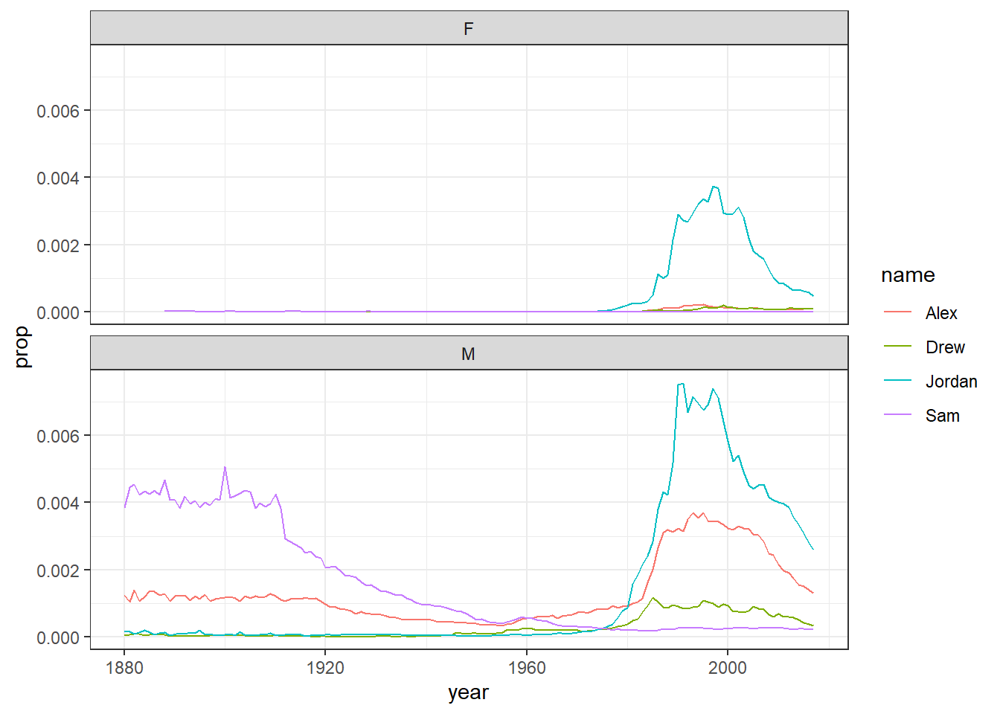

# Data wrangling 1

So far we having been starting to get our head around data and storing them in <a class='glossary' target='_blank' title='A word that identifies and stores the value of some data for later use.' href='https://psyteachr.github.io/glossary/o#object'>objects</a> but as you will learn, data comes in lots of different formats. One of the most common formats is that of a <a class='glossary' target='_blank' title='Data in a rectangular table format, where each row has an entry for each column.' href='https://psyteachr.github.io/glossary/t#tabular-data'>two-dimensional table</a> (the two dimensions being rows and columns).  Usually, each row stands for a separate <a class='glossary' target='_blank' title='A word that identifies and stores the value of some data for later use.' href='https://psyteachr.github.io/glossary/o#object'>object</a> (e.g. a subject), and each column stands for a different variable (e.g. a response, category, or group). A key benefit of tabular data is that it allows you to store different <a class='glossary' target='_blank' title='The kind of data represented by an object.' href='https://psyteachr.github.io/glossary/d#data-type'>types of data</a>, e.g. numerical measurements, alphanumeric labels, categorical descriptors, etc, all in one place.

One of the core skills you will learn when working with data is <a class='glossary' target='_blank' title='The process of preparing data for visualisation and statistical analysis.' href='https://psyteachr.github.io/glossary/d#data-wrangling'>data wrangling</a>. This means completing tasks such as determining <a class='glossary' target='_blank' title='A data point that is extremely distant from most of the other data points' href='https://psyteachr.github.io/glossary/o#outlier'>outliers</a>, clearing up erroneous values, changing the structure of tables, merging information stored in separate tables, reducing the data down to a subset of observations, and producing data summaries. It may surprise you to learn that researchers actually spend far more of time cleaning and preparing their data than they spend actually analysing it. Some have estimated that up to 80% of time spent on data analysis involves such data preparation tasks [@dasu2003]!

When you ask people about data wrangling, many people seem to operate under the assumption that the only approach is the painstaking and time-consuming cutting and pasting of data within a proprietary spreadsheet programs like Excel. Indeed, many may waste days, weeks, and even months manually transforming their data through the laborious cutting, copying, and pasting of data. Wrangling your data manually, by hand, however is not only a terrible use of your time, but it is error-prone and not <a class='glossary' target='_blank' title='Research that documents all of the steps between raw data and results in a way that can be verified.' href='https://psyteachr.github.io/glossary/r#reproducible-research'>reproducible</a>. Additionally, in this day and age where we can easily collect massive datasets online, it is just not conceivable to organise, clean, and prepare this data by hand, and so the alternative and reproducible approach you have begun to learn is highly beneficial. 

In short, being able to perform some key data wrangling skills will allow you the opportunity to thrive, not only as a psychologist but in any of the numerous roles that require handling data. You see the truth is that although every dataset presents unique challenges, there are some systematic principles you should follow that will make your analyses easier, less error-prone, more efficient, and more reproducible.Putting that another way, the data changes but the skills stay the same!

So now let's get into learning some new skills. In this lesson you will see how data wrangling skills will allow you to efficiently get answers to nearly any question you might want to ask about your data. By learning how to properly make your computer do the hard and boring work for you, you can focus on the bigger issues.

## Tidyverse

In the first chapter we introduced a <a class='glossary' target='_blank' title='A group of R functions.' href='https://psyteachr.github.io/glossary/p#package'>package</a> called `tidyverse` and it is going to be at the core of a lot of the data skills you develop. The `tidyverse` [https://www.tidyverse.org/](https://www.tidyverse.org/){target="_blank"} [@tidyverse] is actually a collection of packages developed by a team led by the world-famous data scientist Hadley Wickham. Those core packages contained within `tidyverse` are  `dplyr`, `tidyr`, `readr`, `purrr`,  `ggplot2`, and `tibble`, and  within these six core packages you will have access to <a class='glossary' target='_blank' title='A named section of code that can be reused.' href='https://psyteachr.github.io/glossary/f#function'>functions</a> that will pretty much cover everything you need in order to be able to wrangle and visualise your data.. Again, don't worry about trying to remember all the different packages and what they all do, that will come with practice. The main thing to note however is that previously when you typed `library(tidyverse)` into your code, you will have seen that it loads in all of these packages in one go. You will learn how to use a whole host of functions from the `tidyverse` as we progress, but in this chapter we are going to focus on functions from the `dplyr` package, mainly for data wrangling, and `ggplot2` for visualisation (i.e. creating images and figures). 

Looking at the `dplyr` package specifically, it contains six very important functions based on common English verbs to help readability of the code. These six verbs are often referred to as the Wickham Six "one-table" dplyr verbs as they perform actions on a single table of data. Those six functions are:

|Function|Description|
|:------:|:----------|
|`select()`| Include or exclude certain variables (columns)|
|`filter()`| Include or exclude certain observations (rows)|
|`mutate()`| Create new variables (columns)|
|`arrange()`| Change the order of observations (rows)|
|`group_by()`| Organize the observations (rows) into groups|
|`summarise()`| Create summary variables for groups of observations|

Just looking at the names gives you some idea of what the functions do. For example, `select()`, which we saw previously, selects columns! But don't be fooled, although the operations of these functions may seem very simplistic, it’s amazing what you can accomplish when you string them together. Hadley Wickham, in fact, has claimed that 90% of data analysis can be reduced to the operations described by these six functions. You are going to use the functions but we will introduce them today just to show what they can do.

## Intro to the `babynames` database

To demonstrate the power of the six `dplyr` verbs we will use them to work with data from the `babynames` package. The babynames dataset has historical information about the births of babies in the U.S. from 1880 to the present day and is a nice understandable dataset that will allow us to us just focus on getting to know the functions across a series of activities, beginning now!

### Activity 1: Set-up {#dw1-a1}

Complete the following series of steps. If you are unsure, try consulting the previous two chapters, keeping in mind that this is something we have done before!

1. Open RStudio and set the working directory to your chapter folder. Ensure the environment is clear.
    i. If you are working on the Rserver, avoid a number of issues by restarting the session - top menu: **`Session >> Restart R`** 
2. Open a new R Markdown document and save it in your working directory. Call the file "DataWrangling1.Rmd".   
3. If you are working **on your own computer**, install the package `babynames` using the `install.packages()` function - you will need quotation marks around the package name. **Remember, never install packages if you are working on a university computer or on the Rserver**. 
4. Delete the default R Markdown default text (i.e. everything from line 12 down) and insert a new code <a class='glossary' target='_blank' title='A section of code in an R Markdown file' href='https://psyteachr.github.io/glossary/c#chunk'>code chunk</a> that loads the packages `babynames` and `tidyverse` using `library()` function and run this code chunk. 
    i. Note that the order of packages is deliberate!


```r
library(babynames)
library(tidyverse)
```

<div class="info">
<p><strong>On the order of libraries</strong></p>
<p>In the first chapter you will recall we mentioned the issue of conflicts - the situation where two packages loaded into the library have functions with the same name but different approaches or jobs. The default approach that R takes in this situation is to "mask" the function from the library that was loaded in first. That means that it will use the function from the library loaded in most recently. As <code>tidyverse</code> contains the functions that you will use most of the time, the safest approach is to always load in the <code>tidyverse</code> last, regardless of the other packages you are loading in. In truth, as with everything in life, there is an additional complication involved that sometimes arises but for now taking the approach of running <code>library(tidyverse)</code> last is going to save a lot of issues.</p>
</div>

### Activity 2: Look at the data {#dw1-a2}

Great! Now that we have our packages loaded in let's look at our data. The package `babynames` is a bit unique in that it contains an object of the same name, `babynames`, that contains all the data about, well, baby names, and we can look at that object to get a sense of our data.

* Have a look at your data by typing the word `babynames` into your <a class='glossary' target='_blank' title='The pane in RStudio where you can type in commands and view output messages.' href='https://psyteachr.github.io/glossary/c#console'>console</a> window and running it.


```r
babynames
```

You should see something like the following output:

<div class="kable-table">

| year|sex |name      |    n|      prop|
|----:|:---|:---------|----:|---------:|
| 1880|F   |Mary      | 7065| 0.0723836|
| 1880|F   |Anna      | 2604| 0.0266790|
| 1880|F   |Emma      | 2003| 0.0205215|
| 1880|F   |Elizabeth | 1939| 0.0198658|
| 1880|F   |Minnie    | 1746| 0.0178884|
| 1880|F   |Margaret  | 1578| 0.0161672|

</div>

The first line tells us "# A tibble: 1924665 x 5". What this means is that the object we are looking at is actually a <a class='glossary' target='_blank' title='A container for tabular data with some different properties to a data frame' href='https://psyteachr.github.io/glossary/t#tibble'>tibble</a>, a type of two dimensional table with some unique properties, and we have data across 1924665 variables (columns) with 1924665 million observations (rows). Yes, this dataset contains over 1.9 **million** observations. Interested in analyzing these data by hand? No thanks!  

Looking at the column names you start to get a sense of what the data is. The variables (columns) are as follows:

|variable|type             |description
|--------|-----------------|--------------------------------------------|
|  year  |double (numeric) |year of birth|
|  sex 	|character 	      |recorded sex of baby (F = female, M = male)|
|  name 	|character 	      |forename given to baby|
|  n 	  |integer 	        |number of babies given that name|
|  prop 	|double (numeric) |	proportion of all babies of that sex|

As such, each row represents data about births for a given name and sex in a given year. For example, the first row of the data tells us that in the year 1880, there were 7065 baby girls (F) born in the U.S.A who were given the name Mary, and this accounted for 7.238359% of all baby girls that year.

### Activity 3: Your first plot {#dw1-a3}

Brilliant! Now we know what our data looks like in terms of the table - or really the `tibble` - let's show you a quick code to help visualise some of this data.

* In a new code chunk in your R Markdwon file, type the code below and run it. 


```r
dat <- babynames %>% 
  filter(name %in% c("Emily",
                     "Kathleen",
                     "Alexandra",
                     "Beverly"), sex=="F")

ggplot(data = dat,
       aes(x = year,
           y = prop, 
           colour = name))+
  geom_line()  
```

And you should see this output:

<div class="figure" style="text-align: center">

<p class="caption">(\#fig:babynames-plot-real)Proportion of four baby names from 1880 to 2014</p>
</div>

Now we know that the code right now will not make much sense to you but don't worry about that as we don't expect you to fully understand the code just yet. The point is really to show you how much you can accomplish with very little code. The code creates a figure (Figure \@ref(fig:babynames-plot-real)) showing the popularity of four girl baby names - Alexandra, Beverly, Emily, and Kathleen - from 1880 to 2014. Popularity here is expressed in proportion (y-axis) in different years (x-axis). As you will come to learn, `ggplot()` is the main visualisation function, and `geom_line()` creates a linegraph.

* Now change the names in your code chunk to some female names you like and run the code to see how the Figure changes. 
* Now change the names in your code chunk to some male names and change the sex from “F” to “M”. Run the code and see what happens. Post the photos of your new plots on the Teams channel.
* Now change the code to what you want to display and post an image of your favorite figure that you have created on the TEAMS channel and get some praise from the TEAM! 


<div class='webex-solution'><button>But I want to display male AND female names!</button>


This is more complicated than you might first imagine so only read on if you're feeling confident. If you remove the filter for `sex` when creating `dat` and then run the plot code again, it will make a very messy looking plot (try it). This is because for most names there will be two data points because although the numbers might be small for gendered names, there is usually always at least one baby of the non-dominant name gender that has been assigned that name.

You can get around this by adding an additional line of code that produces separate plots by sex. See here: 


```r
dat2 <- babynames %>% 
  filter(name %in% c("Emily","Kathleen","Alexandra","Beverly"))

ggplot(data = dat2,aes(x = year,y = prop, colour=name))+
  geom_line() +
  facet_wrap(~sex, scales = "free_y", nrow = 2)
```

<div class="figure" style="text-align: center">

<p class="caption">(\#fig:chpt4-hid1)Plots by sex with different scales</p>
</div>

The `facet_wrap()` function is one that can split up figures based on a given variable - in this case `sex`, meaning give me a plot for all the different sex categories we have. The `scales` argument tells the code that it can use different scales on the y-axis for each plot - when there's a large difference between the two scales this is helpful to allow you to see the data in both sets (run this code and then remove the scales argument and run it again to see the difference) although it does run the risk of people misinterpreting the data if the difference between the scales isn't made clear.

On the other hand, if the scales for your two groups are fairly similar, it's better to keep the same scales to aid comparison. This time we will filter the dataset for gender neutral names where it might make more sense to have them on the same scale - again try it with and without the scales argument to see what happens


```r
dat3 <- babynames %>% 
  filter(name %in% c("Sam","Alex","Jordan","Drew"))

ggplot(data = dat3,aes(x = year,y = prop, colour=name))+
  geom_line() +
  facet_wrap(~sex, nrow = 2)
```

<div class="figure" style="text-align: center">

<p class="caption">(\#fig:chpt4-show1)Plots by sex with the same scale</p>
</div>

</div>


As a side point, because in most countries assigned sex at birth is binary, there is no data on intersex, trans or non-binary names. In lieu of that, here’s the [Wikipedia page](https://en.wikipedia.org/wiki/Unisex_name){target="_blank"} about gender-neutral names and naming laws around the world which will hopefully make you question why we ascribe someone’s entire gender identity to a bunch of sounds and letters we use to label them.

## Six functions for wrangling the `babynames`

Ok so now we have a fairly code understanding of the babynames, let's use it to learn a bit more about the six functions from `dplyr` that make up a lot of data wrangling!

### Activity 4: Selecting variables of interest  with `select()` {#dw1-a4}

Often data has a lot of variables we don't need and it can be easier to focus on just the data we do need. In `babynames` there are two numeric measurements of name popularity - `prop`, the proportion of all babies with each name, is probably more useful than `n`, the total number of babies with that name, because `prop` takes into account that different numbers of babies are born in different years. 

Now as we saw previously, if we wanted to create a dataset that only includes certain variables, we can use the `select()` function from the `dplyr` package. 

* In a new code chunk, type and run the below code to select only the columns `year`, `sex`, `name` and `prop` and store it as a `tibble` in the object named `babynames_reduced`.
    * the first argument `.data` is the object we want to select variables from, in this case `babynames`
    * the additional arguments are the names of the variables you want to **keep**!


```r
babynames_reduced1 <- select(.data = babynames,
                            year, 
                            sex, 
                            name, 
                            prop)
```

Alternatively, you can also state which variables you don't want to keep! This is really handy if you want to keep a lot of columns and only get rid of maybe one or two. 

* Type and run in the below code in a new code chunk.
    * Here, rather than stating you want to keep `year`, `sex`, `name` and `prop`, we can say drop (i.e. get rid of) the column `n` using the minus sign `-` before the variable name.


```r
babynames_reduced2 <- select(.data = babynames, 
                             -n)
```

**Note** that `select()` does not change the original tibble, `babynames`, but makes a new object that stores a new tibble with the specified columns, i.e. `babynames_reduced1` and `babynames_reduced2`. You will see the new objects in your environment pane. If you don't save the new tibbles to an object, they won't be saved. For example, the below code does the same as the previous code but is not saved as the output of the function is not assigned (using the <a class='glossary' target='_blank' title='The symbol <-, which functions like = and assigns the value on the right to the object on the left' href='https://psyteachr.github.io/glossary/a#assignment-operator'>assignment operator</a>, `<-`) to a new object. 


```r
select(.data = babynames, 
       -n)
```

### Activity 5: Arranging the data with `arrange()` {#dw1-a5}

Superb! We now know how to select variables. Another handy skill is being able to change the order of data in a tibble. The function `arrange()` will sort the rows in the table according to the columns you supply. 

* Type and run the below code in a new code chunk.
    * the first argument `.data` again says what object to work on
    * the second argument says what column to sort the data by - in this instance we are sorting by `name`
    * the default sorting order is ascending!


```r
sort_asc <- arrange(.data = babynames,
                    name)
```

If you look in `sort_asc` the data are now sorted in ascending alphabetical order by name. But what if you want the data in descending order? Here we can wrap the name of the variable in the `desc()` function. 

* Type and run the below code in a new code chunk. When you have run the code have a look at `sort_desc` and note that the data is not sorted by descending year!


```r
sort_desc <- arrange(babynames, 
                     desc(year)) 
```

Finally, you can also sort by more than one column and a combination of ascending and descending columns. Have a look at th below code and then answer the question below:


```r
arrange(babynames, 
        desc(year), 
        desc(sex), 
        desc(prop)) 
```

The above code will produce: <div class='webex-radiogroup' id='radio_ITEPEAJZCD'><label><input type="radio" autocomplete="off" name="radio_ITEPEAJZCD" value=""></input> <span>the data sorted by descending year and sex but ascending prop</span></label><label><input type="radio" autocomplete="off" name="radio_ITEPEAJZCD" value=""></input> <span>the data sorted by descending year and prop but ascending sex</span></label><label><input type="radio" autocomplete="off" name="radio_ITEPEAJZCD" value="answer"></input> <span>the data sorted by descending year, sex and prop</span></label><label><input type="radio" autocomplete="off" name="radio_ITEPEAJZCD" value=""></input> <span>the data sorted by ascending year, sex and prop</span></label></div>


<div class='webex-solution'><button>Explain this answer</button>

As all the columns stated are wrapped in the `desc()` function inside the `arrange()` function then all columns will be sorted in descending fashion, sorting the year first, then the sex, then the prop. Note however that the output is not being stored at all in a new object so you would not be able to work on the data later without saving it in an object first!

</div>


### Activity 6: Using `filter()` to choose observations {#dw1-a6}

We are doing well here! OK, so we have previously used `select()` to keep certain variables (i.e. columns). However, frequently you will also want to keep only certain observations (i.e. rows) - for example, only babies born after 1999, only Female babies (as above), or only babies named "Mary". You do this using the verb `filter()`. The `filter()` function is a bit more involved than the other verbs, and requires more detailed explanation, but this is because it is also extremely powerful. 

Here is an example of filter() function in action. Take a few minutes to think about what it might do. Perhaps even run it in a new code chunk and look at the ouput!


```r
filt1 <- filter(.data = babynames, 
                year > 2000)
```

Had a think about it? We are going to tell you now so maybe write down your answer before reading on!

OK, let's see if you are correct. The first part of the code tells the function to use the object `babynames`. The second argument, `year > 2000`, is what is known as a **Boolean expression**: an expression whose evaluation (or action) results in a value of either TRUE or FALSE. What `filter()` does here really is keep any observations (rows) for which the expression (`year > 2000` - which reads as "year greater than 2000") evaluates as TRUE, and excludes (removes) any row for which the expression evaluates to FALSE. So in effect, behind the scenes, `filter()` goes through the entire set of 1.9+ million observations, row by row, checking the value of year for each row, keeping it if the value is greater than 2000, and rejecting it if it is less than 2000. 

To see how a boolean expression works, consider the code below. First we create an object will all the values (let's pretend they are years) from 1996:2005.


```r
years <- 1996:2005
years
```

```
##  [1] 1996 1997 1998 1999 2000 2001 2002 2003 2004 2005
```

Now we run the same boolean expression fomr above across this set of values:


```r
years > 2000
```

```
##  [1] FALSE FALSE FALSE FALSE FALSE  TRUE  TRUE  TRUE  TRUE  TRUE
```

You can see that the expression `years > 2000` returns a **logical vector** (a <a class='glossary' target='_blank' title='A type of data structure that collects values with the same data type, like T/F values, numbers, or strings.' href='https://psyteachr.github.io/glossary/v#vector'>vector</a> of TRUE and FALSE values), where each entry represents whether the expression (`year > 2000`) is TRUE or FALSE for that an entry in `years`. For the first five `years` (1996 to 2000) the answer is FALSE as they are less than 2000, and for the last five `years` (2001 to 2005) it is TRUE. Note that 2000 returns as FALSE because 2000 is not greater than 2000; it would instead be equivalent to 2000.

Here are the most commonly used Boolean expressions.

Operator	|Name	                 |is TRUE if and only if
----------|----------------------|---------------------------------
A < B 	  |less than 	           |A is less than B
A <= B 	  |less than or equal    |A is less than or equal to B
A > B 	  |greater than 	       |A is greater than B
A >= B 	  |greater than or equal |A is greater than or equal to B
A == B 	  |equivalence 	         |A exactly equals B
A != B 	  |not equal 	           |A does not exactly equal B
A %in% B 	|in 	                 |A is an element of vector B

We will run through a few of these just to introduce them so you get the idea. We would suggest typing each one in a new code chunk and running them and looking at the output to get an idea of what it does. 

First example is if you want only those observations for a specific name (e.g., Mary), you use the equivalence operator `==`. Note that you use double equal signs, not a single equal sign.


```r
only_Marys <- filter(babynames, 
                     name == "Mary")
```

Alternatively, if you wanted all the names except Mary, you use the 'not equals' operator which is a single equals sign preceeded by an exclamation mark:


```r
no_Marys <- filter(babynames, 
                   name != "Mary") 
```

Next, what if you wanted names from a defined set - e.g., names of British queens? Just like we did previously, you can use the `%in%` approach shown here.


```r
queens <- filter(babynames, 
                 name %in% c("Mary",
                             "Elizabeth",
                             "Victoria"))
```

This gives you data for the names in the vector on the right hand side of `%in%`. Note that the names are all held together in the `c()` which we have seen before, and each name is surrounded by quotation marks and seperated by a comma.

Next, a bit like when we got rid of all Marys, you can always invert an expression to get its opposite - that is what the exclamation mark tends to do. So, for instance, if you instead wanted to get rid of all Marys, Elizabeths, and Victorias you would use the following:


```r
no_queens <- filter(babynames, 
                    !(name %in% c("Mary",
                                  "Elizabeth",
                                  "Victoria")))
```

Ok so that is a brief intro to filters but it is worth keeping in mind that you can include as many expressions as you like as additional arguments to `filter()` and it will only pull out the rows for which all of the expressions evaluate to TRUE. For instance, `filter(babynames, year > 2000, prop > .01)` will keep only the rows (observations) where the year is greater than 2000  and that represent greater than 1% of the names for a given sex; any observation where either expression is false will be excluded. This ability to string together criteria makes `filter()` a very powerful member of the Wickham Six. Referring back to this section will help with a lot of the answers to problems you face when wrangling data!

### Activity 7: Creating new variables with `mutate()` {#dw1-a7}

Doing really well! Only a little more to go we promise! OK so we have really learnt a lot about changing the data we have but sometimes we need to create a new variable that doesn’t exist in our dataset. For instance, we might want to figure out what decade a particular year belongs to in out babynames data and add that to our data! To create new variables, we use the function `mutate()`. 

* Type and run the below code in a new code chunk.
    * Here, you are mutating a new column onto the data and storing it in the object `baby_decades`
    * the first argument is the original data, `babynames`
    * the second argument is the name of the new column `decade` followed by what you want in that column - the decade.
    * we are creating the decades using the code `floor(year/10)*10. This seems complicated but it says take the year and divide by 10, then get rid of the decimal places, and then multiply by 10. So for example, 1945/10 = 194.5, and if you get rid of the decimal places that becomes 194, and multiply it by 10 gives you 1940s!.


```r
baby_decades <- mutate(.data = babynames,
                  decade = floor(year/10) *10)
baby_decades
```

The start of the data will look something like this with the new column called `decade` mutated on:

<div class="kable-table">

| year|sex |name      |    n|      prop| decade|
|----:|:---|:---------|----:|---------:|------:|
| 1880|F   |Mary      | 7065| 0.0723836|   1880|
| 1880|F   |Anna      | 2604| 0.0266790|   1880|
| 1880|F   |Emma      | 2003| 0.0205215|   1880|
| 1880|F   |Elizabeth | 1939| 0.0198658|   1880|
| 1880|F   |Minnie    | 1746| 0.0178884|   1880|
| 1880|F   |Margaret  | 1578| 0.0161672|   1880|

</div>


But mutates can be much simpler like this example here. Have a look at the code and then answer the question below:


```r
baby_where <- mutate(.data = babynames,
                  country = "USA")
```

What will be stored in the object `baby_where`? <div class='webex-radiogroup' id='radio_IWSFUTEKFH'><label><input type="radio" autocomplete="off" name="radio_IWSFUTEKFH" value=""></input> <span>a tibble with one column called country that contains the decade people were born</span></label><label><input type="radio" autocomplete="off" name="radio_IWSFUTEKFH" value="answer"></input> <span>a tibble with all the original data and a new column called country stating USA</span></label><label><input type="radio" autocomplete="off" name="radio_IWSFUTEKFH" value=""></input> <span>a tibble with all the original data and a new column stating usa</span></label><label><input type="radio" autocomplete="off" name="radio_IWSFUTEKFH" value=""></input> <span>a tibble with all the original data arranged by the country USA</span></label></div>


<div class='webex-solution'><button>Explain this Answer</button>

This code will create a new object storing a tibble that has all the original data and a new column called country that states USA for each row. The `mutate()` adds to what is already there unless you add a `select()` or `filter()` to remove columns or rows. Note that one of the answers is wrong because it states usa in lowercase but the code states it in uppercase, i.e. USA. Remember to be specific.

</div>


### Activity 8: Grouping and summarising {#dw1-a8}

Brilliant! You are learning so much about changing data and just one more important step to go. The goal of wrangling in quantitative analysis is to summarise your data somehow! Perhaps you want to calculate the mean or median, or a sum total of your data. You can perform all of these operations using the function `summarise()`.

First, let's use the object `dat` from above that just has the data for the four girls names, Alexandra, Beverly, Emily, and Kathleen. Type and run this code in a new code chunk if `dat` does not already exist in your environment pane:


```r
dat <- babynames %>% 
  filter(name %in% c("Emily",
                     "Kathleen",
                     "Alexandra",
                     "Beverly"), sex == "F")
```

Now to start off, we're going to calculate the total number of babies across all years that were given one of these four names.

* Type and run the below code in a new code chunk
    * `summarise()` is the function we use to create summaries of the data
    * as per usual the first argument is the object we want to use, in this case `dat`
    * the second argument is the name of the summary column, in this case `total`, and the summary value we want to create, in this case the sum, using `sum()`, of all the values in `n`.


```r
dat_sum <- summarise(.data = dat,
                     total = sum(n))
```

A **top tip** when coding is to get in the habit of translating your code into full sentences to make it easier to figure out what's happening. You can read the above code as "run the function `summarise()` using the data in the object `dat` to create a new variable named `total` that is the result of adding up all the numbers in the column `n` and store it in `dat_sum`". If you look in `dat_sum` you will see the below output:


Here we see we have a total of 2161374 babies with those four names in our dataset! We will learn more summary functions as we go along, but `summarise()` becomes even more powerful when combined with the final `dplyr` function, `group_by()`. Quite often, you will want to produce your summary statistics broken down by groups, for examples, the scores of participants in different conditions, or the reading time for native and non-native speakers and that is what `group_by()` helps us do.

There are two ways you can use `group_by()`. First, you can create a new, grouped object as such. Here we are saying use the `group_by()` function to group the data in `dat` based on the categories in the variable `name`.

* Type and run this code in a new code chunk.


```r
group_dat <- group_by(.data = dat,
                      name) 
```

If you look at this object in the viewer, it won't look any different to the original `dat`, however, the underlying structure has changed - you can see this by typing group_dat in the console window and running it. It says the number of groups in the secpnd line of the output - "# Groups:   name [4]" 

However, let's run the above summarise code again, but now using the new `group_dat` object and look at the output.

* Type and run the below code in a new code chunk


```r
group_sum <- summarise(.data = group_dat, 
                       total = sum(n)) 
```

`summarise()` has performed exactly the same operation as before - adding up the total number in the column `n` - but this time it has done is separately for each group, which in this case was the variable `name` and gives an output that looks like this:

<div class="kable-table">

|name      |  total|
|:---------|------:|
|Alexandra | 231364|
|Beverly   | 376914|
|Emily     | 841491|
|Kathleen  | 711605|

</div>

<div class="info">
<p>If you get what looks like an error that says <code>summarise() ungrouping output (override with .groups argument)</code>don't worry, this isn't an error it's just R telling you what it's done to the groups that you have created and will become more obvious with more examples in later chapters.</p>
</div>

And two more final examples to show that you can request multiple summary calculations to be performed in the same function. For example, the following code calculates the mean and median number of babies given each name every year.


```r
sum_multi <- summarise(group_dat,
                       mean_year = mean(n),
                       median_year = median(n))
```

And you can also add multiple grouping variables. For example, the following code groups `baby_decades` by `sex` and `decade` and then calculates the summary statistics to give us the mean and median number of male and female babies in each decade.


```r
group_decades <- group_by(baby_decades, 
                          sex, 
                          decade)

sum_decades <- summarise(group_decades,
                         mean_year = mean(n),
                         median_year = median(n))
```

And again if you look at `sum_decades`, the first few lines would look something like this:

<div class="kable-table">

|sex | decade| mean_year| median_year|
|:---|------:|---------:|-----------:|
|F   |   1880|  110.5702|          13|
|F   |   1890|  128.1841|          13|
|F   |   1900|  131.3290|          12|
|F   |   1910|  187.0628|          12|
|F   |   1920|  210.5457|          12|
|F   |   1930|  214.1987|          12|

</div>

Excellent! We have now had a run through of all of the Wickham six functions that allow us to arrange, select, filter, mutate, group by and summarise our data!

## Introducing Pipes {#dw1-a9}

The final activity for this chapter essentially repeats what we've already covered but in a slightly different way. In the previous activities, you created new objects with new variables or groupings and then you called `summarise()` on those new objects in separate lines of code. As a result, you had multiple objects in your environment pane and you need to make sure that you keep track of the different names. 

Instead, you can use <a class='glossary' target='_blank' title='A way to order your code in a more readable format using the symbol %>%' href='https://psyteachr.github.io/glossary/p#pipe'>pipes</a>. Pipes are written as `%>%` and can be read as "and then". Pipes allow you to string together 'sentences' of code into 'paragraphs' so that you don't need to create intermediary objects. Really, this is something that is easier to show than tell.

The below code does very similar to all the code we wrote above but it only creates one object.


```r
pipe_summary <- babynames %>%
  mutate(decade = floor(year/10) *10) %>%
  filter(name %in% c("Emily",
                     "Kathleen",
                     "Alexandra",
                     "Beverly"), sex=="F") %>%
  group_by(name, 
           decade) %>%
  summarise(mean_decade = mean(n))
```

```
## `summarise()` has grouped output by 'name'. You can override using the `.groups` argument.
```

Again, just to note, you may see a warning when you run the above code regarding groups in the - this is similar to the previous time we saw the message and it is just letting you know what the output is grouped by. Nothing to worry about it basically. And if we then, as is good practice, look at the output from the above code, the first few lines would gives us:

<div class="kable-table">

|name      | decade| mean_decade|
|:---------|------:|-----------:|
|Alexandra |   1890|    6.500000|
|Alexandra |   1900|    8.285714|
|Alexandra |   1910|   32.700000|
|Alexandra |   1920|   37.000000|
|Alexandra |   1930|   44.400000|
|Alexandra |   1940|  117.100000|

</div>

Now just to explain a little more, the reason that this function, the `%>%`, is called a pipe is because it 'pipes' the data through to the next function. When you wrote the code previously, the first argument of each function was the dataset you wanted to work on. When you use pipes it will automatically take the data from the previous line of code so you don't need to specify it again.

<div class="info">
<p><strong>Read your pipe like a paragraph</strong></p>
<p>When learning to code it can be a useful practice to read your code 'out loud' in full sentences to help you understand what it is doing. You can read the code above as "starting with <code>babynames</code>, create a new variable called <code>decade</code> AND THEN keep only the names Emily, Kathleen, Alexandra and Beverly and that belong to female babies, AND THEN group the dataset by name and decade AND THEN calculate the mean number of babies with each name per decade." Try doing this each time you write a new bit of code and you should find the code becomes much easier to follow</p>
</div>

Some people find pipes a bit tricky to understand from a conceptual point of view, however, it's well worth learning to use them as when your code starts getting longer they are much more efficient and mean you have to write less code which is always a good thing! 

## Finished! {#dw1-fin}

Brilliant! That has been a lot of information but hopefully it has started to give you a sense of some of the approaches to data wrangling and the main functions we will use as we get deeper into the book! 

## Test yourself {#ld-test}

### Knowledge Questions

1. Which of the following is not one of the Wickham Six functions? <div class='webex-radiogroup' id='radio_NHUBVOKHZL'><label><input type="radio" autocomplete="off" name="radio_NHUBVOKHZL" value="answer"></input> <span>melt()</span></label><label><input type="radio" autocomplete="off" name="radio_NHUBVOKHZL" value=""></input> <span>arrange()</span></label><label><input type="radio" autocomplete="off" name="radio_NHUBVOKHZL" value=""></input> <span>mutate()</span></label><label><input type="radio" autocomplete="off" name="radio_NHUBVOKHZL" value=""></input> <span>filter()</span></label></div>


2. Which of the following functions would I use if I wanted to keep only certain columns? <div class='webex-radiogroup' id='radio_DWTAPIIDYB'><label><input type="radio" autocomplete="off" name="radio_DWTAPIIDYB" value="answer"></input> <span>select()</span></label><label><input type="radio" autocomplete="off" name="radio_DWTAPIIDYB" value=""></input> <span>arrange()</span></label><label><input type="radio" autocomplete="off" name="radio_DWTAPIIDYB" value=""></input> <span>mutate()</span></label><label><input type="radio" autocomplete="off" name="radio_DWTAPIIDYB" value=""></input> <span>filter()</span></label></div>


3. Which of the following functions would I use if I wanted to keep only certain rows? <div class='webex-radiogroup' id='radio_JEWBPFLFAK'><label><input type="radio" autocomplete="off" name="radio_JEWBPFLFAK" value=""></input> <span>select()</span></label><label><input type="radio" autocomplete="off" name="radio_JEWBPFLFAK" value=""></input> <span>arrange()</span></label><label><input type="radio" autocomplete="off" name="radio_JEWBPFLFAK" value=""></input> <span>mutate()</span></label><label><input type="radio" autocomplete="off" name="radio_JEWBPFLFAK" value="answer"></input> <span>filter()</span></label></div>


4. Which of the following functions would I use if I wanted to add a new column of information? <div class='webex-radiogroup' id='radio_EZJOTPWRLV'><label><input type="radio" autocomplete="off" name="radio_EZJOTPWRLV" value=""></input> <span>select()</span></label><label><input type="radio" autocomplete="off" name="radio_EZJOTPWRLV" value=""></input> <span>arrange()</span></label><label><input type="radio" autocomplete="off" name="radio_EZJOTPWRLV" value="answer"></input> <span>mutate()</span></label><label><input type="radio" autocomplete="off" name="radio_EZJOTPWRLV" value=""></input> <span>filter()</span></label></div>


5. Which boolean expression would I add to a `filter()` function to keep only Male babies in the original `babynames` data? <div class='webex-radiogroup' id='radio_SFWUMXPJHG'><label><input type="radio" autocomplete="off" name="radio_SFWUMXPJHG" value=""></input> <span>sex == F</span></label><label><input type="radio" autocomplete="off" name="radio_SFWUMXPJHG" value="answer"></input> <span>sex == M</span></label><label><input type="radio" autocomplete="off" name="radio_SFWUMXPJHG" value=""></input> <span>sex < F</span></label><label><input type="radio" autocomplete="off" name="radio_SFWUMXPJHG" value=""></input> <span>Sex == M</span></label></div>


<div class='webex-solution'><button>Explain these Answers</button>


1. `melt()` is not a function in the Wickham six functions. It is actually a function but not one we tend to use.
2. `select()` is the function for keeping and removing columns.
3. `filter()` is the function for keeping and removing rows.
4. `mutate()` is the function for adding new columns.
5.  Assuming the original data has not been changed, `"sex == M"` would work and not `"Sex == M"` as there is no column called Sex with an uppercase S. Remember to be exact.

</div>


### Debugging exercises {#dw1-debugex}

1. Restart the R session (**`Session >> Restart R`**). Make sure that the working directory is set to the right folder and then run the below code in your console window:


```r
babynames
```

This will produce the error:

```
Error: object 'babynames' not found
```

Once you figure out how to fix this error, make a note of it.


<div class='webex-solution'><button>Solution</button>

This is an indication that you have not loaded the `babynames` package into the library using the `library()` function

</div>

<br>

2. Restart the R session (**`Session >> Restart R`**). Make sure that the working directory is set to the right folder and then run the below code in your console window:


```r
library(babynames)

dat <- summarise(.data = babynames, mean_n = mean(n))
```

This will produce the error:

```
Error in summarise(.data = babynames, mean_n = mean(n)) : 
  could not find function "summarise"
```

Once you figure out how to fix this error, make a note of it.


<div class='webex-solution'><button>Solution</button>

What the error is saying is that there is no function called `summarise()`. You know that function exists though. What you have not done is call load the function into the libary using `library(tidyverse)`

</div>

<br>

3. Restart the R session (**`Session >> Restart R`**). Make sure that the working directory is set to the right folder and then run the below code in your console window:


```r
library(babynames)
library(tidyverse)

dat <- summarise(.data = babynames mean_n = mean(n))
```

This will produce the error:

```
Error: unexpected symbol in "dat <- summarise(.data = babynames mean_n"

```
Once you figure out how to fix this error, make a note of it.


<div class='webex-solution'><button>Solution</button>

This is actually one of the most painful errors you can see as it doesn't really help you solve your issue because it is not quite clear what it means. **unexpected symbol** means effectively that the code is wrong and it is seeing something it did not think it would see. Again not that clear right? What we do when we see this is ask ourselves have we forgotten a comma somewhere or maybe a bracket or a quotation mark! Look for those issues and see if that helps. The error does show you that the error comes between `babynames` and `mean_n` it just isn't clear that that is what it means. The issue will be around the last word it mentions basically. The answer here is that there is a comma missing between the data and the arguement; between `babynames` and `mean_n`. The line should read: 


```r
library(babynames)
library(tidyverse)

dat <- summarise(.data = babynames, mean_n = mean(n))
```

Again an incredibly frustrating and time consuming error. Watch out for these. It is why partitioning the code on to new lines after a comma can be really help see errors as such:


```r
library(babynames)
library(tidyverse)

dat <- summarise(.data = babynames, 
                 mean_n = mean(n))
```

Such a dastardly error! Well done if you spotted it!!!


</div>

<br>

## Words from this Chapter

Below you will find a list of words that were used in this chapter that might be new to you in case it helps to have somewhere to refer back to what they mean. The links in this table take you to the entry for the words in the [PsyTeachR Glossary](https://psyteachr.github.io/glossary/){target="_blank"}. Note that the Glossary is written by numerous members of the team and as such may use slightly different terminology from that shown in the chapter.


|term                                                                                                                         |definition                                                                                                   |
|:----------------------------------------------------------------------------------------------------------------------------|:------------------------------------------------------------------------------------------------------------|
|[assignment operator](https://psyteachr.github.io/glossary/a.html#assignment-operator){class="glossary" target="_blank"}     |The symbol <-, which functions like = and assigns the value on the right to the object on the left           |
|[chunk](https://psyteachr.github.io/glossary/c.html#chunk){class="glossary" target="_blank"}                                 |A section of code in an R Markdown file                                                                      |
|[console](https://psyteachr.github.io/glossary/c.html#console){class="glossary" target="_blank"}                             |The pane in RStudio where you can type in commands and view output messages.                                 |
|[data type](https://psyteachr.github.io/glossary/d.html#data-type){class="glossary" target="_blank"}                         |The kind of data represented by an object.                                                                   |
|[data wrangling](https://psyteachr.github.io/glossary/d.html#data-wrangling){class="glossary" target="_blank"}               |The process of preparing data for visualisation and statistical analysis.                                    |
|[function](https://psyteachr.github.io/glossary/f.html#function){class="glossary" target="_blank"}                           |A named section of code that can be reused.                                                                  |
|[object](https://psyteachr.github.io/glossary/o.html#object){class="glossary" target="_blank"}                               |A word that identifies and stores the value of some data for later use.                                      |
|[outlier](https://psyteachr.github.io/glossary/o.html#outlier){class="glossary" target="_blank"}                             |A data point that is extremely distant from most of the other data points                                    |
|[package](https://psyteachr.github.io/glossary/p.html#package){class="glossary" target="_blank"}                             |A group of R functions.                                                                                      |
|[pipe](https://psyteachr.github.io/glossary/p.html#pipe){class="glossary" target="_blank"}                                   |A way to order your code in a more readable format using the symbol %>%                                      |
|[reproducible research](https://psyteachr.github.io/glossary/r.html#reproducible-research){class="glossary" target="_blank"} |Research that documents all of the steps between raw data and results in a way that can be verified.         |
|[tabular data](https://psyteachr.github.io/glossary/t.html#tabular-data){class="glossary" target="_blank"}                   |Data in a rectangular table format, where each row has an entry for each column.                             |
|[tibble](https://psyteachr.github.io/glossary/t.html#tibble){class="glossary" target="_blank"}                               |A container for tabular data with some different properties to a data frame                                  |
|[vector](https://psyteachr.github.io/glossary/v.html#vector){class="glossary" target="_blank"}                               |A type of data structure that collects values with the same data type, like T/F values, numbers, or strings. |

**End of Chapter**

That is end of this chapter. Be sure to look again at anything you were unsure about and make some notes to help develop your own knowledge and skills. It would be good to write yourself some questions about what you are unsure of and see if you can answer them later or speak to someone about them. Good work today!
