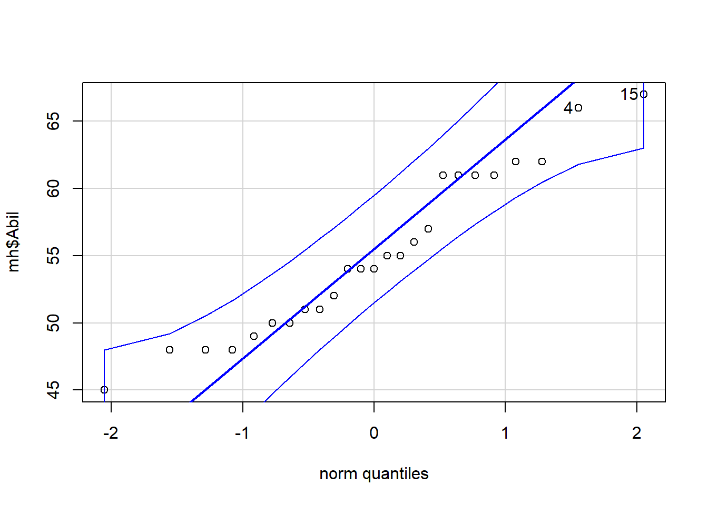

# Correlation


We have spent the chapters so far focusing on the basics of R and data wrangling. You may think that the tasks we ask you to do in R will get harder as this course progresses but that isn't true. The hardest part of learning R is at the very beginning, trying to learn the new terminology, figuring out how to load in data and wrangle it into the format you need. It may feel like you are still struggling so it's worth reflecting on just how far you've come in a short time.

You can now:

* Understand what functions, arguments, objects, variables, and tibbles are  
* Read data into R  
* Tidy data into an appropriate format  
* Calculate a range of descriptive statistics
* Create plots of data

That's amazing! Now we're going to move on to performing a correlation and to create a plot to visualise the data. 

## Correlation

As [Miller and Haden (2013)](https://drive.google.com/file/d/0B1fyuTuvj3YoaFdUR3FZaXNuNXc/view) state at the start of Chapter 11, correlations are **used to detect and quantify relationships among numerical variables**. In short, you measure two variables and the correlation analysis tells you whether or not they are related in some manner - positively or negatively; one increases as the other increases; one decreases as the other increases; etc.. 

To actually carry out a correlation is very simple and we will show you that today in a little while.  The harder part of correlations is really wrangling the data and interpreting what the results mean. You are going to run a few correlations in this chapter to give you good practice at running and interpreting the relationships between two variables. 

**Note:** When dealing with correlations you should always refer to relationships and not predictions. In a correlation, X does not predict Y, that is regression which you will cover in later in this course. In a correlation, all we can say is whether X and Y are related. 

## Activity 1: Set-up {#corr-a1}

In this chapter we will use the examples in Miller and Haden (2013), Chapter 11, looking at the relationship between four variables: reading ability, intelligence (IQ), the number of minutes per week spent reading at home (Home); and the number of minutes per week spent watching TV at home (TV). You can see in this situation that it would be unethical to manipulate these variables so measuring them as they exist in the environment is most appropriate; hence the use of correlations.

* Open R Studio and set the working directory to your Correlation folder. Ensure the environment is clear.    
* Open a new R Markdown document and save it in your working directory. Call the file "Correlation".    
* Download <a href="MillerHadenData.csv" download>MillerHadenData.csv</a> and save it in your Correlation folder and/or upload to to the R server. Make sure that you do not change the file name at all.  
* If you're on the server, avoid a number of issues by restarting the session - click `Session` - `Restart R` 
* Delete the default R Markdown welcome text and insert a new code chunk that loads the packages `car`, `correlation`, `report`, `psych`, and `tidyverse` (in that order) using the `library()` function and loads the data into an object named `mh` using `read_csv()`. You may need to install some of these packages if you don't already have them. 

## Activity 2: Look at your data {#corr-a2}

* Look at your data, you can do this by clicking on the object in the environment, or using `summary(mh)` or `head(mh)`. 

As in Miller and Haden, we have 5 columns: 

1. The participant (`Participant`), 
2. Reading Ability score (`Abil`), 
3. Intelligence score (`IQ`), 
4. Number of minutes spent reading at home per week (`Home`), 
5. And number of minutes spent watching TV per week (`TV`). 

For the chapter we will focus on Reading Ability and IQ but for further practice you can look at other relationships in your free time.  

A probable hypothesis could be that as Reading Ability increases so does Intelligence (but think of the issue with causality and direction). Phrasing the hypothesis more formally, we hypothesise that the reading ability of school children, as measured through a standardized test, and intelligence, again measured through a standardized test, are positively correlated.  

## Activity 3: Assumptions {#corr-a3}

First, however, we must check some assumptions of the correlation tests. The main assumptions we need to check are:

1. Is the data interval, ratio, or ordinal?
2. Is there a data point for each participant on both variables?
3. Is the data normally distributed in both variables?
4. Does the relationship between variables appear linear?
5. Does the spread have homoscedasticity?

We will look at these in turn.

### Assumption 1: Level of Measurement

If we want to run a Pearson correlation then we need interval or ratio data; Spearman correlations can run with ordinal, interval or ratio data. What type of data do we have?  

* The type of data in this analysis is most probably <select class='webex-select'><option value='blank'></option><option value=''>ratio</option><option value='answer'>interval</option><option value=''>ordinal</option><option value=''>nominal</option></select> as the data is <select class='webex-select'><option value='blank'></option><option value='answer'>continuous</option><option value=''>discrete</option></select> and there is unlikely to be a true zero


<div class='webex-solution'><button>Hints on data type</button>


* Are the variables continuous? 
* Is the difference between 1 and 2 on the scale equal to the difference between 2 and 3?

</div>
  

### Assumption 2: Pairs of Data

All correlations must have a data point for each participant in the two variables being correlated. This should make sense as to why - you can't correlate against an empty cell! So now go check that you have a data point in both columns for each participant. 

It looks like that everyone has data in all the columns but let's test our skills a little whilst we are here.  Answer the following questions:

1. How is missing data represented in a tibble? <select class='webex-select'><option value='blank'></option><option value=''>an empty cell</option><option value='answer'>NA</option><option value=''>a large number</option><option value=''>don't know</option></select>
2. Which code would leave you with just the participants who were missing Reading Ability data in mh: 
<select class='webex-select'><option value='blank'></option><option value=''>filter(mh, is.na(Ability)</option><option value='answer'>filter(mh, is.na(Abil)</option><option value=''>filter(mh, !is.na(Ability)</option><option value=''>filter(mh, !is.na(Abil)</option></select>
3. Which code would leave you with just the participants who were not missing Reading Ability data in mh: <select class='webex-select'><option value='blank'></option><option value=''>filter(mh, is.na(Ability)</option><option value=''>filter(mh, is.na(Abil)</option><option value=''>filter(mh, !is.na(Ability)</option><option value='answer'>filter(mh, !is.na(Abil)</option></select>


<div class='webex-solution'><button>Hints on removing missing data points</button>


* `filter(dat, is.na(variable))` versus `filter(dat, !is.na(variable))`

</div>
  

### Assumption 3-5: Normality, linearity, homoscedasticity

The remaining assumptions are all best checked through visualisations. You can use histograms and QQ-plots to check that the data (`Abil` and `IQ`) are both normally distributed, and you can use a scatterplot of IQ as a function of Abil to check whether the relationship is linear, with homoscedasticity, and without outliers. There are various options and tests for assessing these assumptions but today we will just use visual checks.

* Run the below code to create a histogram for `Abil`.


```r
ggplot(data = mh, aes(x = Abil)) +
  geom_histogram()
```

<div class="figure" style="text-align: center">

<p class="caption">(\#fig:abil-hist)Histogram of Abil</p>
</div>

This code should look very similar to the code you used to create a bar plot in Intro to Data Viz. We have specified that we want to display `Abil` on the x-axis and that the shape we want to produce is a histogram, hence `geom_histogram()`. Just like `geom_bar()`, you do not need to specify the y-axis because if it's a histogram, it's always a count.

* Write and run the code to produce another histogram for the variable `IQ`.

The QQ-plots require us to use the package `car` rather than `ggplot2`. You can make QQ-plots in `ggplot2` but they aren't as useful, however, the code is still very simple.

* Run the below code to create a QQ-plot for `Abil`.


```r
qqPlot(x = mh$Abil)
```

<div class="figure" style="text-align: center">

<p class="caption">(\#fig:qq-abil)QQ-plot for Abil</p>
</div>

```
## [1] 15  4
```

This code looks a little different to code you've used up until this point as it comes from Base R. It uses the notation `object$variable` so our x variable could be read as "use the variable `Abil` from the object `mh`.

The QQ-plot includes a **confidence envelope** (the blue dotted lines). The simple version is that if your data points fall within these dotted lines then you can assume normality. The `ggplot2` version of QQ-plots make it more difficult to add on this confidence envelope, which is why we're using a different package. `qqPlot()` will also print the IDs of the most extreme data points. In this case, the 4th and 15th data point in `Abil` are flagged, although because they fall within the confidence envelope, they don't appear problematic.

* Write and run the code to create a QQ-plot for `IQ`.

In order to assess linearity and homoscedasticity, we can create a scatterplot using `ggplot2`. 

## Correlation Scatterplot

The `ggplot2` code is very similar to what you have already encountered with the bar chart and violin-boxplot. The first line of data sets up the base of the plot and we specify that we wish to display `Abil` on the x-axis, `IQ` on the y-axis, and use the dataset `mh`. 

The first geom, `geom_point()` adds in the data points, the second geom, `geom_smooth` adds in the line of best fit. The shaded area around the line is a **confidence interval**.


```r
ggplot(data = mh, aes(x = Abil, y = IQ)) +
  geom_point()+
  geom_smooth(method = lm) # if you don't want the shaded CI, add se = FALSE to this
```

```
## `geom_smooth()` using formula 'y ~ x'
```

<div class="figure" style="text-align: center">

<p class="caption">(\#fig:unnamed-chunk-4)Scatterplot of scores</p>
</div>

* Remember that `ggplot2` works on layers and that you customise each layer. Edit the above code to add in layer of `scale_x_continuous()` that changes the label `Abil` to `Reading Ability`.

Based on the above visualisations:

* Is the assumption of normality met for both variables? <select class='webex-select'><option value='blank'></option><option value='answer'>Yes</option><option value=''>No</option></select>
* Is the assumption of linearity met for both variables? <select class='webex-select'><option value='blank'></option><option value='answer'>Yes</option><option value=''>No</option></select>
* Is the assumption of homoscedasticity met for both variables? <select class='webex-select'><option value='blank'></option><option value='answer'>Yes</option><option value=''>No</option></select>


<div class='webex-solution'><button>Explain these answers</button>

When assessing assumptions through the use of visualisations your decision will always be a judgement call. In this dataset, we only have data from 25 participants therefore it is very unlikely we would ever observe perfect normality and linearity in this dataset. It is likely that a researcher would assume that this data is approximately normal, that there is no evidence of a non-linear relationship, and that the spread of data points around the line is relatively even.

Many students become fixated with needing a 'perfect' dataset that follows an exactly normal distribution. This is unlikely to ever happen with real data - learn to trust your instincts!
    

</div>

<br>

Look at the scatterplot and think back to the lecture, how would you describe this correlation in terms of direction and strength? 

## Activity 4: Descriptive statistics {#corr-a4}

Many researchers (and indeed members of the School of Psychology!) disagree as to whether you need to report descriptive statistics such as the mean and SD for a correlation. The argument against reporting them is that the scatterplot is actually the descriptive of the correlation that you would use to describe the potential relationship in regards to your hypothesis. 

The counter argument is that providing descriptive statistics can still be informative about the spread of data for each variable, for example, in the current example it would make it easier to understand whether the participants as a whole compare to the population IQ score.

There's no fixed answer to this question but the person writing this book takes the second view that you should always report descriptive statistics so that's what we're going to do.

* Calculate the mean score and standard deviation for `Abil` and `IQ` using `summarise()` 
* Name the output of the calculations `Abil_mean`, `Abil_SD`, `IQ_mean`, and `IQ_SD`. Make sure to use these exact spellings otherwise later activities won't work.
* Store the output of this in an object called `descriptives` and then view the object. It should look something like this:  


| Abil_mean | Abil_SD | IQ_mean | IQ_SD |
|:---------:|:-------:|:-------:|:-----:|
|   55.12   |  6.08   | 100.04  | 9.04  |


## Activity 5: Run the correlation {#corr-a5}

Finally we will run the correlation. There are often many different functions that can be used to achieve the same thing in R, and we're actually going to show you two ways of running a correlation.

First, we'll use the `correlation()` function from the `correlation` package. Remember that for help on any function you can type e.g., `?correlation` in the console window.  The `correlation()` function requires:

* The name of the data set you are using
* The name of the first variable you want to select for the correlation
* The name of the second variable you want to select for the correlation
* The type of correlation you want to run: e.g. `pearson`, `spearman`
* The type of NHST tail you want to run: e.g. `"less"`,`"greater"`, `"two.sided"`

For example, if your data is stored in `dat` and you want to do a two-sided pearson correlation of the variables (columns) `X` and `Y`, then you would do:


```r
correlation(data = dat, select = "X", select2 = "Y",  method = "pearson", alternative = "two.sided")
```

* Based on your answers to the assumption tests, decide which correlation method to use (e.g. pearson or spearman) and the type of NHST tail to set (e.g. two.sided or one.sided). 
* Run the correlation between IQ and Ability and save it in an object called `results`.
* View the output by typing `View(results)` in the console

The second method is to use `cor.test()` which is a Base R function and uses similar code as `correlation()` except for how the variables are specified. `cor.test()` use formula syntax in the form `~ x + y` where x and y are the two variables you wish to correlate.

* Run the below code and then view the output by typing `results2` in the console. Look at how the output differs from `results`.


```r
results2 <-  cor.test(~ IQ + Abil, data = mh,  method = "pearson", alternative = "two.sided")
```

We'll come back to why we've shown you two ways shortly.

## Activity 6: Interpreting the correlation {#corr-a6}

You should now have a tibble called `results` that gives you the output of the correlation between Reading Ability and IQ for the school children measured in Miller and Haden (2013) Chapter 11. All that is left to do now, is interpret the output. 

Look at `results`and then answer the following questions:

1. What is the value of Pearson's *r* to 2 decimal places? <input class='webex-solveme nospaces' size='20' data-answer='[".45","0.45"]'/>
2. The direction of the relationship between Ability and IQ is: <select class='webex-select'><option value='blank'></option><option value='answer'>positive</option><option value=''>negative</option><option value=''>no relationship</option></select>
3. The strength of the relationship between Ability and IQ is: <select class='webex-select'><option value='blank'></option><option value=''>strong</option><option value='answer'>medium</option><option value=''>weak</option></select>
4. Based on $\alpha = .05$ the relationship between Ability and IQ is: <select class='webex-select'><option value='blank'></option><option value='answer'>significant</option><option value=''>not significant</option></select>
5. The hypothesis was that the reading ability of school children, as measured through a standardized test, and intelligence, again through a standardized test, are positively correlated. Based on the results we can say that the hypothesis: <select class='webex-select'><option value='blank'></option><option value='answer'>is supported</option><option value=''>is not supported</option><option value=''>is proven</option><option value=''>is not proven</option></select> 


<div class='webex-solution'><button>Explain these answers</button>


1. The test statistic, in this case the r value, is usually labelled as the `estimate`.
2. If Y increases as X increases then the relationship is positive. If Y increases as X decreases then the relationship is negative. If there is no change in Y as X changes then there is no relationship
3. Depending on the field most correlation values greater than .5 would be strong; .3 to .5 as medium, and .1 to .3 as small. 
4. The field standard says less than .05 is significant and our p-value is less than .05.
5. Hypotheses can only be supported or not supported, never proven. In this case, our results matched our hypothesis therefore it is supported.

</div>
  

## Activity 7: Write-up {#corr-a7}

Copy and paste the below **exactly** into **white space** in your R Markdown document and then knit the file. 


```r
The mean IQ score was `r round(pluck(descriptives$IQ_mean),2)` (`r round(pluck(descriptives$IQ_SD),2)`) and the mean reading ability score was `r round(pluck(descriptives$Abil_mean),2)` (`r round(pluck(descriptives$Abil_SD),2)`). A Pearson\`s correlation found a significant, medium positive correlation between the two variables (r (`r results$df_error`) = `r round(results$r, 2)`, *p* = `r round(results$p, 3)`).
```

It will magically transform into:

>The mean IQ score was 100.04(9.04) and the mean reading ability score was 55.12(6.08). A Pearson\`s correlation found a significant, medium positive correlation between the two variables (r (23) = 0.45, *p* = 0.024)

The reason that we have shown you two methods of performing correlations is because of the way each outputs the results. `correlation()` produces a tibble which means it is very easy to work with and pull out values or join to another table as needed because it is already in tidyverse format. 

`cor.test()` on the other hand produces a `list` type object, which is a bit harder to work with. However, the output of `cor.test()` also happens to work with functions from the `report` package, `report()` and `report_table()` that automatically reports the results of statistical analyses for you.

`report()` presents a fixed write-up of the correlation with all the available information. For correlations, this is perhaps less than useful, however, for more complex statistics this reporting function can really help and so we're introducing it now. 


```r
report(results2)
```

```
## Effect sizes were labelled following Funder's (2019) recommendations.
## 
## The Pearson's product-moment correlation between IQ and Abil is positive, statistically significant, and very large (r = 0.45, 95% CI [0.07, 0.72], t(23) = 2.42, p = 0.024)
```

`report()` doesn't currently work with the output of `correlation()` which is why we showed you both ways. 

## Activity 8: Scatterplot matrix {#corr-a8}

Above we ran one correlation. However, when you have lots of variables in a dataset, to get a quick overview of patterns, you might want to run all the correlations at the same time or create a matrix of scatterplots at the one time. You can do this with functions from the `psych` and `correlation` packages (`cor.test()` only works for one correlation at a time). We will use the Miller and Haden data here again which you should still have in a tibble called `mh`. 

* Run the following code The `pairs.panels())` function from the `psych` library creates a matrix of scatterplots, with the histograms, and correlation coefficients which you can then use to give you an overview of all the relationships at the one time. 


```r
pairs.panels(mh)
```

<div class="figure" style="text-align: center">

<p class="caption">(\#fig:pairs)Scatterplot matrix</p>
</div>

Notice something wrong? `pairs.panels()` will create plots for **all** variables in your data (as will `correlation()` below). This means that it has correlated the Participant ID number as well, which is totally meaningless.

Instead, we can use pipes to help us out here. This code:

* Takes the dataset `mh` and then;
* Uses `select()` to drop the `Participant` column and then;
* Pipes this adjusted data into the `pairs.panels()` function
* The additional arguments turn off the [correlation ellipses](https://analyse-it.com/docs/user-guide/multivariate/scatter-plot#:~:text=If%20the%20association%20is%20a,more%20the%20variables%20are%20uncorrelated.), use a linear line of best fit, and specify a Pearson's correlation.


```r
mh %>%
  select(-Participant) %>%
  pairs.panels(ellipses = F, lm = TRUE, method = "pearson")
```

<div class="figure" style="text-align: center">

<p class="caption">(\#fig:pairs-pipes)Adjusted scatterplot matrix</p>
</div>

There are additional arguments to adjust the plot `pairs.panel` creates that you can look up in the help documentation if you are interested.

## Activity 9: Multiple correlations {#corr-a9}

To perform multiple correlations in one go, we will again use the `correlation()` function. package. Rather than specifying two variables to correlation, you can also provide a data frame that has multiple variables  and it will run all possible correlations between the variables. Similar to above, we want to remove the `Participant` column before we do this.   

* `method` controls which correlation is computed, the default is `pearson` but if you needed to run the non-parametric version you could change this to `spearman`.  
* `p_adjust` is the reason we are using the `correlation` package. In the lectures we discussed the problem of multiple comparisons - the idea that if you run lots and lots of tests you're likely to produce a significant p-value just by chance. This argument applies a correction to the p-value that adjusts for the number of correlations you have performed. There are several different methods which you can look up in the help documentation, the default setting is a Bonferroni-Holm correction.  
* Because you're running multiple correlations and some may be positive and some may be negative, there is no option to specify a one or two-tailed test.   

* Run the below code to calculate then view the correlation results


```r
corr_results <- mh %>%
  select(-Participant) %>%
  correlation(method = "pearson", p_adjust = "holm")

corr_results
```

`corr_results` is a tibble that lists the results of each correlation with its corresponding statistics. Look through the table and then answer the following questions:

1. Is the correlation between `Abil` and `Home` positive or negative? <select class='webex-select'><option value='blank'></option><option value='answer'>Positive</option><option value=''>Negative</option></select>
2. This means that as `Abil` scores increase, `Home` scores will <select class='webex-select'><option value='blank'></option><option value='answer'>Increase</option><option value=''>Decrease</option></select>
3. What is the strongest positive correlation? <select class='webex-select'><option value='blank'></option><option value=''>Abil * IQ</option><option value='answer'>Abil * Home</option><option value=''>Abil * TV</option></select>
4. What is the strongest negative correlation? <select class='webex-select'><option value='blank'></option><option value=''>Abil * TV</option><option value=''>IQ * TV</option><option value='answer'>Home * TV</option></select>
5. Is the correlation between `Abil` and `IQ` significant? <select class='webex-select'><option value='blank'></option><option value=''>Yes</option><option value='answer'>No</option></select>
6. Is the correlation between `Abil` and `Home` significant? <select class='webex-select'><option value='blank'></option><option value='answer'>Yes</option><option value=''>No</option></select>
7. How would you describe the strength of the correlation between `Home` and `TV`? <select class='webex-select'><option value='blank'></option><option value=''>Weak</option><option value=''>Medium</option><option value='answer'>Strong</option></select>
8. Think back to the lecture. Why are we not calculating an effect size?


<div class='webex-solution'><button>Explain these answers</button>

1. Negative correlations are denoted by a negative r value.  
    2. Positive correlations = as one score goes up so does the other, negative correlations = as one score goes up the other goes down.  
    3 & 4. Remember that correlations take values from -1 - 1 and that the nearer to one in either direction the stronger the correlation (i.e., an r value of 0 would demonstrate a lack of any relationship.  
    5 & 6. The traditional cut-off for significance is .05. Anything below .05 is considered significant. Be careful to pay attention to decimal places.  
    7. Cohen's guidelines recommend weak = 1. - .3, medium = .3 - .5, strong > .5.  
    8. Because r is an effect size.

</div>
  
<br>  


## Finished! {#corr-fin}

Well done! You can now add correlations to the list of things you can do in R. If you have any questions, please post them on Teams.

## Activity solutions {#corr-sols}

### Activity 1 {#corr-a1sol}


<div class='webex-solution'><button>Activity 1</button>


```r
library("car")
library("correlation")
library("report")
library("psych")
library("tidyverse")
mh <- read_csv("MillerHadenData.csv")
```

</div>
  

**click the tab to see the solution**
<br>

### Activity 3 {#corr-a3sol}


<div class='webex-solution'><button>Activity 3</button>


```r
# histogram
ggplot(data = mh, aes(x = IQ)) +
  geom_histogram()

# qqplot
qqPlot(x = mh$IQ)

# edited scatterplot
ggplot(data = mh, aes(x = Abil, y = IQ)) +
  geom_point()+
  geom_smooth(method = lm)+
  scale_x_continuous(name = "Reading Ability")
```

</div>
  

**click the tab to see the solution**
<br>

### Activity 4 {#corr-a4sol}


<div class='webex-solution'><button>Activity 4</button>


```r
descriptives <- summarise(mh, 
                          Abil_mean = mean(Abil),
                          Abil_SD = sd(Abil),
                          IQ_mean = mean(IQ),
                          IQ_SD = sd(IQ))
```

</div>
  

**click the tab to see the solution**
<br>

### Activity 5 {#corr-a5sol}


<div class='webex-solution'><button>Activity 5</button>


```r
results <- correlation(data = mh, select = "IQ", select2 = "Abil",  method = "pearson", alternative = "two.sided")
```

</div>
  

**click the tab to see the solution**
<br>

