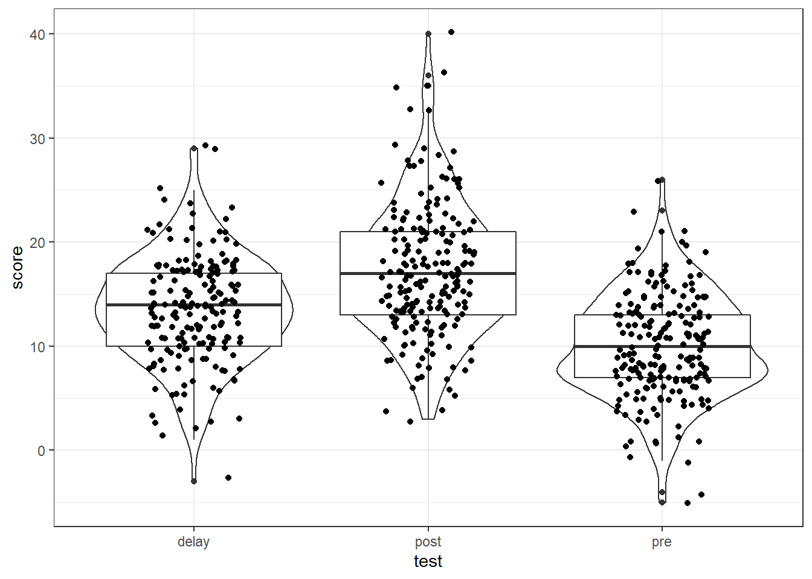

# Screening Data 

In this chapter we're going to focus on how to screen datasets for  potential issues and to reinforce the concept of tidy data. So far, we've given you complete datasets to work with, however, you will find that real data is often much messier than this, for example, participants may not answer some items in your questionnaire or there may be errors or implausible values in your dataset. We're also going to show you a different function to make calculating descriptive statistics easier. 

## Activity 1: Set-up {#screening-a1}

Do the following. 

* Open R Studio and set the working directory to your chapter folder. Ensure the environment is clear. 
* Open a new R Markdown document and save it in your working directory. Call the file "Screening Data".    
* Download <a href="messy.csv" download>messy.csv</a> and save it in your Screening Data folder. Make sure that you do not change the file name at all.  
* If you're on the server, avoid a number of issues by restarting the session - click `Session` - `Restart R` 
* Delete the default R Markdown welcome text and insert a new code chunk that loads the `tidyverse` and `psych` packages using the `library()` function and loads the data into an object named `messy` using `read_csv()`


## Activity 2: Look at the data {#screening-a2}

`messy` is simulated data for an experiment looking at the effect of note-taking on test performance and whether this is affected by being a native speaker. Participants are first given a pre-test to judge their baseline knowledge, then they watch a lecture and take notes. Immediately after the lecture is finished they take another test. Finally, they are tested after a week delay. The maximum score for any test is 30. Participants lose marks for incorrect answers so minus scores are also possible. The dataset has six variables:

* `id` = the participant ID number  
* `age` = the age of the participant
* `speaker` = if the participant is a native or non-native English speaker  
* `gender` = if the participant is male, female, or non-binary  
* `pre` = pre-test score before any notes were taken  
* `post` = post-test score immediately after the lecture  
* `delay` = test score after one week delay

## Missing data

The first issue we will cover is missing data. Data can be missing because your participants accidentally didn't fill in a question, it can be missing because they intentionally didn't want to answer, or that they didn't turn up to a final testing session, or it could be that you did something wrong whilst setting up your questionnaire/experiment and it didn't save. Real data frequently contains missing values and it's important that you know how to identify missing data and what you can do with it.

## Activity 3: `summary()` {#screening-a3}

A good way to get a sense of how many missing data points you have is to use `summary()`. Because `speaker` and `gender` are text rather than numbers, in order to see how many values are missing we first need to convert them to factors.

* Run the below code  


```r
messy <- messy %>%
  mutate(speaker = as.factor(speaker), 
         gender = as.factor(gender))

summary(messy)
```

As you can see, there are 20 data points missing (NAs) in each of `speaker`, `gender`, and `delay` (but importantly, this isn't from just 20 participants).There are several different approaches to dealing with missing data. We will cover the most common.

## Activity 4: Listwise deletion {#screening-a4}

One method for dealing with missing data is **listwise deletion**. This approach removes any participant with a single missing value. So if there is missing data in any of the columns in the dataset, that participant will be removed and you will only be left with complete datasets. We can achieve this using `drop_na`

* Run the below code and then view the object.  


```r
messy_listwise <- drop_na(messy)
```

As you can see `messy_listwise` now only contains data from participants with a complete set of data. This might seem like a good thing, and sometimes it is the most appropriate option, however, there are a couple of important points to consider. 

First, `gender` isn't part of our experiment - it's not one of the IVs, it's just there as demographic information. We wouldn't include `gender` in any of our analyses but because of listwise deletion we have deleted experimental data if the participant was missing `gender`. This is related to the second problem which is that using full listwise deletion may result in the loss of a lot of data. Look at the environment pane - the original dataset had 200 participants, after using `drop_na()` we only have 143 so we've lost over 25% of our data by doing this. If this was real data we would also want to check if the missing values were coming from one particular group (i.e., non-random attrition).

One option is to amend the use of `drop_na()` so that it doesn't include `gender` and we can do this using the same code as we would if we were using `select()`.

* Run the below code. How many observations does `messy_listwise2` have? <input class='webex-solveme nospaces' size='3' data-answer='["161"]'/>


```r
messy_listwise2 <- drop_na(messy, -gender)
```

## Pairwise deletion

The alternative to listwise deletion is **pairwise deletion** when cases are removed depending upon the analysis. For example, if we were to calculate the correlations between `pre`, `post`, and `delay` without removing participants with missing data in the `delay` condition, R would use different numbers of participants in each correlation depending on missing data which you can see in the `Sample Sizes` section.


```
## 
## CORRELATIONS
## ============
## - correlation type:  pearson 
## - correlations shown only when both variables are numeric
## 
##         pre     post    delay   
## pre       .    0.448*** 0.512***
## post  0.448***     .    0.548***
## delay 0.512*** 0.548***     .   
## 
## ---
## Signif. codes: . = p < .1, * = p<.05, ** = p<.01, *** = p<.001
## 
## 
## p-VALUES
## ========
## - total number of tests run:  3 
## - correction for multiple testing:  holm 
## 
##         pre  post delay
## pre       . 0.000 0.000
## post  0.000     . 0.000
## delay 0.000 0.000     .
## 
## 
## SAMPLE SIZES
## ============
## 
##       pre post delay
## pre   200  200   180
## post  200  200   180
## delay 180  180   180
```

## Activity 5: `na.rm = TRUE` {#screening-a5}

When running inferential tests like correlations and t-tests, R will usually know when to ignore missing values. However, if you're calculating descriptive statistics or if you want to calculate the average score of a number of different items, you need to explicitly tell R to ignore the missing values.

* Run the below code to calculate the mean score for each testing condition.


```r
summarise(messy, 
          pre_mean = mean(pre),
          post_mean = mean(post),
          delay_mean = mean(delay)
          )
```


| pre_mean | post_mean | delay_mean |
|:--------:|:---------:|:----------:|
|  10.02   |   17.27   |     NA     |

The mean score for `delay` shows as `NA`. This is because R is trying to calculate an average of a dataset and including the missing value and this creates a logical problem (how do you take the average of nothing?). In order to calculate the mean we have to tell R to ignore the missing values by adding `na.rm = TRUE` to our code. You can read this as "remove the NAs? Yes".

* Run the below code. What is the mean score for the `delay` condition to 2 decimal places? <input class='webex-solveme nospaces' size='5' data-answer='["13.57"]'/>


<div class="danger">
<p>It's really important that you think about whether you want to calculate your descriptives from participants that have missing data. For example, if you are calculating the average reaction time from hundreds of trials, a few missing data points won't affect the validity of the mean. However, if you are using a standardised questionnaire that has been validated using complete responses but your participants didn't answer 3/10 questions, it may not be appropriate to calculate a mean score from the remaining data.</p>
</div>

## Activity 6: Implausible values {#screening-a6}

A crucial step of data screening is checking for implausible values. What is implausible depends on the data you've collected! `summary()` can also help you out here by looking at the minimum and maximum values.

* Run `summary(messy)` again and look at the minimum and maximum values for each variable. 

* Do the min and max values of `age` look plausible? <select class='webex-select'><option value='blank'></option><option value=''>Yes</option><option value='answer'>No</option></select>
* Do the min and max values of `pre` look plausible? <select class='webex-select'><option value='blank'></option><option value='answer'>Yes</option><option value=''>No</option></select>
* Do the min and max values of `post` look plausible? <select class='webex-select'><option value='blank'></option><option value=''>Yes</option><option value='answer'>No</option></select>
* Do the min and max values of `delay` look plausible? <select class='webex-select'><option value='blank'></option><option value='answer'>Yes</option><option value=''>No</option></select>


<div class='webex-solution'><button>Explain these answers</button>

The maximum value for age is 470, this is unlikely to be correct!
  
The maximum value for pre, post, and delay should be 30, as we described at the start of the chapter. However, for post, the maximum value is 33 so something is wrong. This is a very important check to do on your data, not just for the raw data but if you've calculated a total score.

</div>


## Activity 7: Visualising implausible values {#screening-a7}

Whilst `summary()` can be useful, another key step is to visualise the data to check for implausible values.

How you do this will depend on the data, and your preferences. You could produce violin-boxplots with the data points on top to check the distributions


```r
messy %>%
  pivot_longer(cols = c("pre", "post", "delay"), 
               names_to = "test", 
               values_to = "score") %>%
  ggplot(aes(x = test, y = score)) +
  geom_violin() +
  geom_boxplot() +
  geom_jitter(width = .2)
```

<div class="figure" style="text-align: center">

<p class="caption">(\#fig:unnamed-chunk-4)Data screening plots</p>
</div>

You could also use histograms:


```r
ggplot(messy, aes(x = age)) +
  geom_histogram()
```

<div class="figure" style="text-align: center">

<p class="caption">(\#fig:unnamed-chunk-5-1)Histograms for data screening</p>
</div>

```r
messy %>%
  pivot_longer(cols = c("pre", "post", "delay"), 
               names_to = "test", 
               values_to = "score") %>%
  ggplot(aes(x = score)) +
  geom_histogram(binwidth = 1) +
  facet_wrap(~test)
```

<div class="figure" style="text-align: center">

<p class="caption">(\#fig:unnamed-chunk-5-2)Histograms for data screening</p>
</div>

Whatever method you choose, make sure that you look at your data before trying to work with it and that you know in advance what range your values should take (for example, if your Likert scale is 1-7, you shouldn't have a score of 8, for reaction times, 50ms is unlikely to reflect a real response). 

## Dealing with implausible values or missing data

To remove implausible values you can use `replace` and `mutate`.

* For `age`, we know that we have one very specific data point that is implausible, an age of 470 so we can specify just to replace this one value with NA.
* For `post`, there are multiple missing values so we specify to replace any data point that is over the maximum plausible value (30) with NA.


```r
messy_screen <-  messy %>% 
  mutate(age = replace(age, age == 470, NA),
         post = replace(post, post > 30, NA))
```

There is no hard and fast rule about what to do with missing data. You should review the missing data to see if there are any patterns, for example, is all the missing data from one condition? Does a single participant have a lot of missing data and should they be removed.

One method of dealing with implausible data is to **impute** the data, i.e., to replace missing data with substituted values. There are many methods of doing this, for example, you can replace missing values with the mean. We won't go into which method you should choose this in this chapter but there's [more information available](https://www.theanalysisfactor.com/seven-ways-to-make-up-data-common-methods-to-imputing-missing-data/) online about the various options if you're interested. The code for imputing missing data is relatively simple and uses `mutate()` and `replace_na()`.

* You can read the below code as "create a new variable named `post_impute` that replaces the values of `post` if they're `NA` with the mean of the values in `post`.


```r
messy_impute <- messy_screen %>%
  mutate(post_impute = replace_na(post, 
                                  mean(post, na.rm = TRUE)))
```

## Alternative descriptive statistics

So far in this book, we've calculated descriptive statistics using `summarise()` from the tidyverse. There's a good reason we've done this - the output of `summarise()` works well with `ggplot()` and the code is very flexible. However, there are other options for producing descriptive statistics that it is helpful to know about.

The `psych` package contains many functions that are useful for psychology research. One of the functions of `psych` is `describe()`.

* Run the below code


```r
descriptives <- describe(messy)
descriptives
```

<table>
 <thead>
  <tr>
   <th style="text-align:left;">   </th>
   <th style="text-align:right;"> vars </th>
   <th style="text-align:right;"> n </th>
   <th style="text-align:right;"> mean </th>
   <th style="text-align:right;"> sd </th>
   <th style="text-align:right;"> median </th>
   <th style="text-align:right;"> trimmed </th>
   <th style="text-align:right;"> mad </th>
   <th style="text-align:right;"> min </th>
   <th style="text-align:right;"> max </th>
   <th style="text-align:right;"> range </th>
   <th style="text-align:right;"> skew </th>
   <th style="text-align:right;"> kurtosis </th>
   <th style="text-align:right;"> se </th>
  </tr>
 </thead>
<tbody>
  <tr>
   <td style="text-align:left;"> id* </td>
   <td style="text-align:right;"> 1 </td>
   <td style="text-align:right;"> 200 </td>
   <td style="text-align:right;"> 100.500000 </td>
   <td style="text-align:right;"> 57.8791845 </td>
   <td style="text-align:right;"> 100.5 </td>
   <td style="text-align:right;"> 100.500000 </td>
   <td style="text-align:right;"> 74.1300 </td>
   <td style="text-align:right;"> 1 </td>
   <td style="text-align:right;"> 200 </td>
   <td style="text-align:right;"> 199 </td>
   <td style="text-align:right;"> 0.0000000 </td>
   <td style="text-align:right;"> -1.2180144 </td>
   <td style="text-align:right;"> 4.0926764 </td>
  </tr>
  <tr>
   <td style="text-align:left;"> age </td>
   <td style="text-align:right;"> 2 </td>
   <td style="text-align:right;"> 200 </td>
   <td style="text-align:right;"> 36.075000 </td>
   <td style="text-align:right;"> 32.3102015 </td>
   <td style="text-align:right;"> 34.0 </td>
   <td style="text-align:right;"> 33.931250 </td>
   <td style="text-align:right;"> 13.3434 </td>
   <td style="text-align:right;"> 18 </td>
   <td style="text-align:right;"> 470 </td>
   <td style="text-align:right;"> 452 </td>
   <td style="text-align:right;"> 12.0951922 </td>
   <td style="text-align:right;"> 159.6718805 </td>
   <td style="text-align:right;"> 2.2846763 </td>
  </tr>
  <tr>
   <td style="text-align:left;"> speaker* </td>
   <td style="text-align:right;"> 3 </td>
   <td style="text-align:right;"> 180 </td>
   <td style="text-align:right;"> 1.511111 </td>
   <td style="text-align:right;"> 0.5012709 </td>
   <td style="text-align:right;"> 2.0 </td>
   <td style="text-align:right;"> 1.513889 </td>
   <td style="text-align:right;"> 0.0000 </td>
   <td style="text-align:right;"> 1 </td>
   <td style="text-align:right;"> 2 </td>
   <td style="text-align:right;"> 1 </td>
   <td style="text-align:right;"> -0.0440855 </td>
   <td style="text-align:right;"> -2.0091259 </td>
   <td style="text-align:right;"> 0.0373625 </td>
  </tr>
  <tr>
   <td style="text-align:left;"> gender* </td>
   <td style="text-align:right;"> 4 </td>
   <td style="text-align:right;"> 180 </td>
   <td style="text-align:right;"> 1.688889 </td>
   <td style="text-align:right;"> 0.7268889 </td>
   <td style="text-align:right;"> 2.0 </td>
   <td style="text-align:right;"> 1.611111 </td>
   <td style="text-align:right;"> 1.4826 </td>
   <td style="text-align:right;"> 1 </td>
   <td style="text-align:right;"> 3 </td>
   <td style="text-align:right;"> 2 </td>
   <td style="text-align:right;"> 0.5452331 </td>
   <td style="text-align:right;"> -0.9643153 </td>
   <td style="text-align:right;"> 0.0541791 </td>
  </tr>
  <tr>
   <td style="text-align:left;"> pre </td>
   <td style="text-align:right;"> 5 </td>
   <td style="text-align:right;"> 200 </td>
   <td style="text-align:right;"> 10.015000 </td>
   <td style="text-align:right;"> 5.0039959 </td>
   <td style="text-align:right;"> 10.0 </td>
   <td style="text-align:right;"> 9.987500 </td>
   <td style="text-align:right;"> 4.4478 </td>
   <td style="text-align:right;"> -5 </td>
   <td style="text-align:right;"> 26 </td>
   <td style="text-align:right;"> 31 </td>
   <td style="text-align:right;"> 0.0555773 </td>
   <td style="text-align:right;"> 0.2559528 </td>
   <td style="text-align:right;"> 0.3538359 </td>
  </tr>
  <tr>
   <td style="text-align:left;"> post </td>
   <td style="text-align:right;"> 6 </td>
   <td style="text-align:right;"> 200 </td>
   <td style="text-align:right;"> 17.270000 </td>
   <td style="text-align:right;"> 6.3386110 </td>
   <td style="text-align:right;"> 17.0 </td>
   <td style="text-align:right;"> 16.968750 </td>
   <td style="text-align:right;"> 5.9304 </td>
   <td style="text-align:right;"> 3 </td>
   <td style="text-align:right;"> 40 </td>
   <td style="text-align:right;"> 37 </td>
   <td style="text-align:right;"> 0.5802699 </td>
   <td style="text-align:right;"> 0.7133158 </td>
   <td style="text-align:right;"> 0.4482075 </td>
  </tr>
  <tr>
   <td style="text-align:left;"> delay </td>
   <td style="text-align:right;"> 7 </td>
   <td style="text-align:right;"> 180 </td>
   <td style="text-align:right;"> 13.600000 </td>
   <td style="text-align:right;"> 5.1563271 </td>
   <td style="text-align:right;"> 14.0 </td>
   <td style="text-align:right;"> 13.645833 </td>
   <td style="text-align:right;"> 4.4478 </td>
   <td style="text-align:right;"> -3 </td>
   <td style="text-align:right;"> 29 </td>
   <td style="text-align:right;"> 32 </td>
   <td style="text-align:right;"> -0.0462551 </td>
   <td style="text-align:right;"> 0.4985955 </td>
   <td style="text-align:right;"> 0.3843299 </td>
  </tr>
</tbody>
</table>

`describe()` produces a full set of descriptive statistics, including skew, kurtosis and standard error for the entire dataset! Run `?describe` to see a full explanation of all the statistics it calculates.

You may have noticed when you ran the code you received a number of error messages. This is because `describe()` doesn't know how to deal with the data that is in `id` which has both numbers and letters. 

Additionally, you should see that `id`, `speaker` and `gender` all have a star next to their name. This star signifies that these variables are factors, and so it is not really appropriate to calculate these statistics, but we asked it to apply `describe` to the entire dataset so it's done what you asked.

`describe()` can be used in conjunction with `select()` to remove these variables.


```r
descriptives2 <- messy %>%
  select(-id, -speaker, -gender) %>%
  describe()

descriptives2
```

<table>
 <thead>
  <tr>
   <th style="text-align:left;">   </th>
   <th style="text-align:right;"> vars </th>
   <th style="text-align:right;"> n </th>
   <th style="text-align:right;"> mean </th>
   <th style="text-align:right;"> sd </th>
   <th style="text-align:right;"> median </th>
   <th style="text-align:right;"> trimmed </th>
   <th style="text-align:right;"> mad </th>
   <th style="text-align:right;"> min </th>
   <th style="text-align:right;"> max </th>
   <th style="text-align:right;"> range </th>
   <th style="text-align:right;"> skew </th>
   <th style="text-align:right;"> kurtosis </th>
   <th style="text-align:right;"> se </th>
  </tr>
 </thead>
<tbody>
  <tr>
   <td style="text-align:left;"> age </td>
   <td style="text-align:right;"> 1 </td>
   <td style="text-align:right;"> 200 </td>
   <td style="text-align:right;"> 36.075 </td>
   <td style="text-align:right;"> 32.310201 </td>
   <td style="text-align:right;"> 34 </td>
   <td style="text-align:right;"> 33.93125 </td>
   <td style="text-align:right;"> 13.3434 </td>
   <td style="text-align:right;"> 18 </td>
   <td style="text-align:right;"> 470 </td>
   <td style="text-align:right;"> 452 </td>
   <td style="text-align:right;"> 12.0951922 </td>
   <td style="text-align:right;"> 159.6718805 </td>
   <td style="text-align:right;"> 2.2846763 </td>
  </tr>
  <tr>
   <td style="text-align:left;"> pre </td>
   <td style="text-align:right;"> 2 </td>
   <td style="text-align:right;"> 200 </td>
   <td style="text-align:right;"> 10.015 </td>
   <td style="text-align:right;"> 5.003996 </td>
   <td style="text-align:right;"> 10 </td>
   <td style="text-align:right;"> 9.98750 </td>
   <td style="text-align:right;"> 4.4478 </td>
   <td style="text-align:right;"> -5 </td>
   <td style="text-align:right;"> 26 </td>
   <td style="text-align:right;"> 31 </td>
   <td style="text-align:right;"> 0.0555773 </td>
   <td style="text-align:right;"> 0.2559528 </td>
   <td style="text-align:right;"> 0.3538359 </td>
  </tr>
  <tr>
   <td style="text-align:left;"> post </td>
   <td style="text-align:right;"> 3 </td>
   <td style="text-align:right;"> 200 </td>
   <td style="text-align:right;"> 17.270 </td>
   <td style="text-align:right;"> 6.338611 </td>
   <td style="text-align:right;"> 17 </td>
   <td style="text-align:right;"> 16.96875 </td>
   <td style="text-align:right;"> 5.9304 </td>
   <td style="text-align:right;"> 3 </td>
   <td style="text-align:right;"> 40 </td>
   <td style="text-align:right;"> 37 </td>
   <td style="text-align:right;"> 0.5802699 </td>
   <td style="text-align:right;"> 0.7133158 </td>
   <td style="text-align:right;"> 0.4482075 </td>
  </tr>
  <tr>
   <td style="text-align:left;"> delay </td>
   <td style="text-align:right;"> 4 </td>
   <td style="text-align:right;"> 180 </td>
   <td style="text-align:right;"> 13.600 </td>
   <td style="text-align:right;"> 5.156327 </td>
   <td style="text-align:right;"> 14 </td>
   <td style="text-align:right;"> 13.64583 </td>
   <td style="text-align:right;"> 4.4478 </td>
   <td style="text-align:right;"> -3 </td>
   <td style="text-align:right;"> 29 </td>
   <td style="text-align:right;"> 32 </td>
   <td style="text-align:right;"> -0.0462551 </td>
   <td style="text-align:right;"> 0.4985955 </td>
   <td style="text-align:right;"> 0.3843299 </td>
  </tr>
</tbody>
</table>


A variant of `describe()` is `describeBy` which works very much like using `summarise()` and `group_by()` together.


```r
descriptives3 <- messy %>%
  select(-id, -speaker) %>%
  describeBy(group = "gender")

descriptives3
```

```
## 
##  Descriptive statistics by group 
## gender: female
##         vars  n  mean    sd median trimmed   mad min max range  skew kurtosis
## age        1 84 38.10 48.64     31   32.96 11.86  18 470   452  8.32    71.04
## gender*    2 84  1.00  0.00      1    1.00  0.00   1   1     0   NaN      NaN
## pre        3 84 10.38  5.06      9   10.28  4.45  -1  23    24  0.24    -0.42
## post       4 84 18.20  6.99     17   17.96  5.93   3  36    33  0.37    -0.08
## delay      5 78 13.18  5.17     13   13.33  5.93  -3  24    27 -0.31     0.15
##           se
## age     5.31
## gender* 0.00
## pre     0.55
## post    0.76
## delay   0.59
## ------------------------------------------------------------ 
## gender: male
##         vars  n  mean    sd median trimmed   mad min max range  skew kurtosis
## age        1 68 34.96 10.03     35   35.09 14.83  18  50    32 -0.05    -1.30
## gender*    2 68  2.00  0.00      2    2.00  0.00   2   2     0   NaN      NaN
## pre        3 68 10.04  4.85     11   10.11  4.45  -5  26    31 -0.05     1.33
## post       4 68 16.28  5.41     16   16.23  5.19   4  33    29  0.25     0.46
## delay      5 59 14.02  5.07     14   14.04  4.45   1  29    28  0.04     0.62
##           se
## age     1.22
## gender* 0.00
## pre     0.59
## post    0.66
## delay   0.66
## ------------------------------------------------------------ 
## gender: nonbinary
##         vars  n  mean   sd median trimmed   mad min max range  skew kurtosis
## age        1 28 34.96 9.25   35.5   34.96 11.86  20  50    30 -0.03    -1.30
## gender*    2 28  3.00 0.00    3.0    3.00  0.00   3   3     0   NaN      NaN
## pre        3 28  9.29 5.36   10.0    9.54  4.45  -4  19    23 -0.48    -0.18
## post       4 28 16.86 5.10   16.0   16.79  4.45   8  26    18  0.35    -0.85
## delay      5 25 12.84 4.67   13.0   12.90  4.45   3  25    22  0.07     0.43
##           se
## age     1.75
## gender* 0.00
## pre     1.01
## post    0.96
## delay   0.93
```

If you look in the environment you will see that `descriptives3` is saved as a `List of 3`. What this means is that the table of descriptives for each gender is saved as a separate table, one for female, one for male, one for non-binary. To get access to them individually, you need to use the `object$variable` notation. 


```r
descriptives3$male
descriptives3$female
descriptives3$nonbinary
```

The output of `describe()` is a little harder to work with in terms of manipulating the table and using the data in subsequent plots and analyses, so we still strongly recommend that you use `summarise()` and `group_by()` for these operations, however, for getting a comprehensive overview of your data, `describe()` is a good function to know about.

## Finished! {#screening-fin}

And you're done! This isn't a comprehensive tutorial on every type of dataset you will come across and the concept of tidy data will take practice but hopefully this should give you a good starting point for when you have your own real, messy data.

## Activity solutions {#screening-sols}

### Activity 1 {#screening-a1sol}


<div class='webex-solution'><button>Activity 1</button>


```r
library("tidyverse")
library("psych")
messy <- read_csv("messy.csv")
```

</div>
  

**click the tab to see the solution**
<br>


