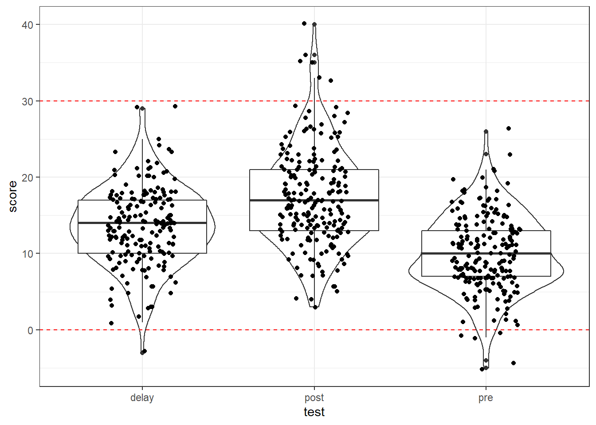

# Screening Data 

In this chapter we're going to focus on how to screen datasets for potential issues and to reinforce the concept of tidy data. So far, we've given you complete datasets to work with, however, you will find that real data is often much messier than this, for example, participants may not answer some items in your questionnaire or there may be errors or implausible values in your dataset. We're also going to show you a different function to make calculating descriptive statistics easier. 

## The Set-Up and the Data

As always we first need to start with setting up our working environment, bringing in our data and looking at it.

#### Activity 1: Set-up {#screening-a1}

* Open RStudio and set the working directory to your chapter folder. Ensure the environment is clear.
    * If you're using the Rserver, avoid a number of issues by restarting the session - click `Session` - `Restart R`
* Open a new R Markdown document and save it in your working directory. Call the file "screeningdata".   
* Download <a href="messy.csv" download>messy.csv</a> and save it in your Screening Data folder. Make sure that you do not change the file name at all. 
  * If you prefer you can download the data in a [zip folder by clicking here](data/chpt12/PsyTeachR_FQA_Chpt12-data.zip){target="_blank"}
  * Remember not to change the file names at all and that `data.csv` is not the same as `data (1).csv`.
* Delete the default R Markdown welcome text and insert a new code chunk that loads the following packages, in this specific order, using the `library()` function. Remember the solutions if needed. 
    * Load the packages in this order, `psych` then `tidyverse`
  * again we have not used some of these packages so you will likely need to install some of them using `install.packages()`. Remember though that you should only do this on your own machine and only in the console window. If you are using the RServer you will not need to install them.
* Finally, load the data held in `messy.csv` as a tibble into an object named `messy` using `read_csv()`. If unsure, have a look at the solution at the end of the chapter


#### Activity 2: Look at the data {#screening-a2}

`messy` is simulated data for an experiment looking at the effect of note-taking on test performance and whether this is affected by being first language English. Participants are first given a pre-test to judge their baseline knowledge, then they watch a lecture and take notes. Immediately after the lecture is finished they take another test. Finally, they are tested after a week's delay. The maximum score for any test is 30. Participants lose marks for incorrect answers so minus scores are also possible. The dataset has six variables:

  * `id` showing the participant ID number
  * `age` showing the age of the participant
  * `speaker`showing if the participant are first language English or not  
  * `gender` showing if the participant is male, female, or non-binary  
  * `pre` showing pre-test score before any notes were taken  
  * `post` showing post-test score immediately after the lecture  
  * `delay` showing test score after one week delay

## Missing data

The first issue we will cover is missing data. There is a whole host of reasons that your data could have missing values. For example:

* Data can be missing because your participants accidentally didn't fill in a question.
* Data can be missing because participants intentionally didn't want to answer a question. 
* Data can be missing because participants didn't turn up to a final testing session. 
* Data can be missing because you did something wrong whilst setting up your questionnaire/experiment and it didn't save. 

In truth, real data frequently contains missing values and it's important that you know how to identify missing data and what you can do with it. Which is what we want to show you a little of in this chapter.

#### Activity 3: `summary()` and `is.na()` {#screening-a3}

Missing data is normally shown in your tibbles and objects as `NA` - usually taken to mean something like "Not Available". We have already seen a couple of approaches to find NAs in our data and we will quickly recap them.

The first approach is to use a pipeline of functions we have used before including `summarise()`, `is.na()`, `sum()`, and `pluck()`. For instance:


```r
messy_na <- messy %>% 
  summarise(find_nas = is.na(speaker)) %>%
  summarise(count_nas = sum(find_nas)) %>%
  pluck("count_nas")
```

Which reads as use `is.na()` to find all the NAs in messy (i.e the first `summarise()`) and then count up all those NAs (i.e. the second `summarise()` - which works because NAs are either TRUE, summed as 1, or FALSE, summed as 0), and then pluck out that number (i.e. the `pluck()`). And if you look at `messy_na` you see there are 20 NAs in `speaker`. That code looks quite long but it could actually be written as below if you prefer and you can follow the pipe inside the `summarise()`.


```r
messy_na <- messy %>% 
  summarise(count_nas = is.na(speaker) %>% sum()) %>% 
  pluck("count_nas")
```

This approach, using `is.na()`, is a good approach if you are only interested in one column or maybe a couple of columns, but if you want a snapshot of all your columns then we can use `summary()` which we have seen previously. First, however, because `speaker` and `gender` are character/text rather than numerical, in order to see how many values are missing we first need to convert these two columns into factors using the below code


```r
messy <- messy %>%
  mutate(speaker = as.factor(speaker), 
         gender = as.factor(gender))

summary(messy)
```

If you run the code, you can see, there are 20 data points missing (NAs) in each of `speaker`, `gender`, and `delay`. However, and the important part if you look at the actual data, the missing data is not in the same 20 participants and that gives us some issues about how to deal with these different participants. Fortunately, there are several different approaches to dealing with missing data and we will cover a few here.

## Listwise Deletion

One method for dealing with missing data is <a class='glossary' title='The removal of participants where they have missing data on any of the variables within the dataset'>listwise deletion</a>. This approach removes any participant who have a missing value (i.e. a NA) in **any** variable. So if there is missing data in any of the columns in the dataset, that participant will be removed and you will only be left with participants with complete datasets. For example the below participants would be removed along with all others with a similar profile:


|  id  | age | speaker | gender | pre | post | delay |
|:----:|:---:|:-------:|:------:|:---:|:----:|:-----:|
| S008 | 48  | english |   NA   | 12  |  15  |  17   |
| S009 | 22  |   NA    |  male  |  5  |  18  |   5   |
| S010 | 31  |   NA    | female | 13  |  35  |  17   |
| S011 | 26  | english |   NA   | 18  |  19  |  16   |

We can achieve this using the `drop_na()` function from the **`tidyr`** package that comes in as part of `tidyverse`.

#### Activity 4: Listwise deletion {#screening-a4}

* Run the below code and then view the tibble in the object called `messy_listwise`.  


```r
messy_listwise <- drop_na(messy)
```

As you can see `messy_listwise` now only contains data from participants with a complete set of data - i.e. responses in each column. 

Now, however, whilst this might seem like a good thing, and sometimes it is the most appropriate option, there are a couple of important points to consider. 

1. First, `gender` might not be part of our experiment; it might just be there as demographic information. So whilst we might not include `gender` in any of our analyses, because of the listwise deletion approach we have deleted experimental data if the participant was missing `gender` which means we are removing participants we could actual use. 
2. Relatedly, using a listwise deletion approach may result in the loss of a lot of data. Compare `messy` to `messy_listwise`. The original dataset had 200 participants. After using `drop_na()` we only have 143 participants meaning that we have lost over 25% of our data with this approach which is a lot of data. 
* **Note:** It is worth mentioning that if you do use a listwise approach you should check that the missing values are not coming from one particular group (i.e., non-random attrition).

To counter these issues, one option is to amend the use of `drop_na()` so that it doesn't include `gender`, or any column for that matter that we don't want to exclude people based on. We can do this using a similar approach to what we have seen when using `select()`. For example, run the below code, have a look at the output and then answer the question:


```r
messy_listwise2 <- drop_na(messy, -gender)
```

* How many observations does `messy_listwise2` have? <input class='webex-solveme nospaces' size='3' data-answer='["161"]'/>

So that approach says "remove participants with NAs from `messy` based on all columns **except** gender". Alternatively, you could do "remove participants with NAs from `messy` based on only the columns of speaker and delay" as follows:


```r
messy_listwise3 <- drop_na(messy, speaker, delay)
```

So you actually have a lot of control with `drop_na()` as long as you plan your approach in advance.

## Pairwise Deletion

The alternative to listwise deletion is <a class='glossary' title='The removal of participants for a given analysis only'>pairwise deletion</a>. This is when cases are removed depending upon the analysis. For example, if we were to calculate the correlations between `pre`, `post`, and `delay` without first removing participants with missing data, we would basically just use different numbers of participants in each correlation depending on missing data. For example, if you compare the degrees of freedom for the following two correlations:


```r
cor.test(messy$pre, messy$post)
```

```
## 
## 	Pearson's product-moment correlation
## 
## data:  messy$pre and messy$post
## t = 7.0493, df = 198, p-value = 2.924e-11
## alternative hypothesis: true correlation is not equal to 0
## 95 percent confidence interval:
##  0.3296550 0.5523276
## sample estimates:
##       cor 
## 0.4479101
```


```r
cor.test(messy$pre, messy$delay)
```

```
## 
## 	Pearson's product-moment correlation
## 
## data:  messy$pre and messy$delay
## t = 7.9619, df = 178, p-value = 1.927e-13
## alternative hypothesis: true correlation is not equal to 0
## 95 percent confidence interval:
##  0.3958642 0.6127887
## sample estimates:
##       cor 
## 0.5124561
```
 


You can see that the correlation of `pre` versus `post` has df = 198 whereas `pre` versus `delay` has df = 178. Meaning that the correlation is by default run only on the participants who have data in both columns - pairwise deletion. The problem here is remembering to write up the output accordingly as the dfs are changing and they may be different from the number of participants you stated in your methods section. Again it is about looking at your data!

## Summarising data with missing values 

So when running inferential tests like correlations, the analysis will usually know when to ignore missing values. However, if you're calculating descriptive statistics or if you want to calculate the average score of a number of different items, you need to explicitly state to ignore the missing values. We can do this through `na.rm = TRUE`

#### Activity 5: `na.rm = TRUE` {#screening-a5}

* Run the below code to calculate the mean score for each testing condition.


```r
summarise(messy, 
          pre_mean = mean(pre),
          post_mean = mean(post),
          delay_mean = mean(delay)
          )
```

This gives a table similar to below. We have rounded all the values to two decimal places but yours might have more decimal places.


| pre_mean | post_mean | delay_mean |
|:--------:|:---------:|:----------:|
|  10.02   |   17.27   |     NA     |

As you can see, the mean score for `delay` shows as `NA`. This is because we are trying to calculate an average of a variable that has missing data and that just isn't doable. As such we need to calculate the mean but ignoring the missing values by adding `na.rm = TRUE` - which you can read this as "remove the NAs? Yes".

* Run the below code and then answer the question. 


```r
summarise(messy, 
          pre_mean = mean(pre),
          post_mean = mean(post),
          delay_mean = mean(delay, na.rm = TRUE)
          )
```

* What is the mean score for the `delay` condition to 2 decimal places? <input class='webex-solveme nospaces' size='5' data-answer='["13.60"]'/>

<div class="danger">
<p>It's really important that you think about whether you want to calculate your descriptives from participants that have missing data. For example, if you are calculating the average reaction time from hundreds of trials, a few missing data points won't affect the validity of the mean. However, if you are using a standardised questionnaire that has been validated using complete responses but your participants didn't answer 3/10 questions, it may not be appropriate to calculate a mean score from the remaining data.</p>
</div>

## Implausible values

Along with looking for missing values, an additional crucial step of data screening is checking for implausible values - values that should not exist in your data. What is implausible depends on the data you've collected!

#### Activity 6: Implausible values {#screening-a6}

Additional functions we can put inside a `summarise()` function are `min()` and `max()`. 

* Run the below code and look at the output and answer the questions below:


```r
messy %>%
  summarise(max_age = max(age, na.rm = TRUE),
            min_age = min(age, na.rm = TRUE),
            max_pre = max(pre, na.rm = TRUE),
            min_pre = min(pre, na.rm = TRUE),
            max_post = max(post, na.rm = TRUE),
            min_post = min(post, na.rm = TRUE),
            max_delay = max(delay, na.rm = TRUE),
            min_delay = min(delay, na.rm = TRUE))
```

<div class="kable-table">

| max_age| min_age| max_pre| min_pre| max_post| min_post| max_delay| min_delay|
|-------:|-------:|-------:|-------:|--------:|--------:|---------:|---------:|
|     470|      18|      26|      -5|       40|        3|        29|        -3|

</div>

* Does the max value of `age` look plausible? <select class='webex-select'><option value='blank'></option><option value=''>Yes</option><option value='answer'>No</option></select>
* Does the max value of `pre` look plausible? <select class='webex-select'><option value='blank'></option><option value='answer'>Yes</option><option value=''>No</option></select>
* Do the max value of `post` look plausible? <select class='webex-select'><option value='blank'></option><option value=''>Yes</option><option value='answer'>No</option></select>
* Do the min value of `delay` look plausible? <select class='webex-select'><option value='blank'></option><option value=''>No</option><option value='answer'>Yes</option></select>


<div class='webex-solution'><button>Explain these answers</button>

The maximum value for age is 470, this is unlikely to be correct!
  
The maximum value for pre, post, and delay should be 30, as we described at the start of the chapter. However, for post, the maximum value is 40 so something is wrong. This is a very important check to do on your data, not just for the raw data but if you've calculated a total score.

The min value for delay is plausible, given the explanation at the start of the chapter. Remember that participants can be deducted points for incorrect answers, so negative values are possible.

</div>


That code above does look a bit long and could be written quicker as below. We won't go into detail as to how this works but see if you can figure it out by comparing the output to the version above:


```r
messy %>% 
  summarise_at(c("age","pre","post","delay"),
               c(max, min),
               na.rm = TRUE)
```

<div class="kable-table">

| age_fn1| pre_fn1| post_fn1| delay_fn1| age_fn2| pre_fn2| post_fn2| delay_fn2|
|-------:|-------:|--------:|---------:|-------:|-------:|--------:|---------:|
|     470|      26|       40|        29|      18|      -5|        3|        -3|

</div>

And there is always `summary(messy)` if you prefer. But the main point is that we should always check our values to make sure they are allowed in our data. But whilst looking at the values is useful, it can be easier to visualise the data.

#### Activity 7: Visualising implausible values {#screening-a7}

There are a number of different ways to visualise the data as you know and this depends on the data, and your preferences. You could produce violin-boxplots with the data points on top to check the distributions as follows:


```r
messy %>%
  pivot_longer(cols = c("pre", "post", "delay"), 
               names_to = "test", 
               values_to = "score") %>%
  ggplot(aes(x = test, y = score)) +
  geom_violin() +
  geom_boxplot() +
  geom_jitter(width = .2)
```

<div class="figure" style="text-align: center">

<p class="caption">(\#fig:fig1)Data screening plots</p>
</div>

And if it helped, you could add some max and min lines to help spot issues using `geom_hline()` as follows:


```r
messy %>%
  pivot_longer(cols = c("pre", "post", "delay"), 
               names_to = "test", 
               values_to = "score") %>%
  ggplot(aes(x = test, y = score)) +
  geom_violin() +
  geom_boxplot() +
  geom_jitter(width = .2) +
  geom_hline(yintercept = c(0,30), color = "red", linetype = 2)
```

<div class="figure" style="text-align: center">

<p class="caption">(\#fig:fig1a)Data screening plots</p>
</div>

Alternatively you could also use a histogram to spot an outlier:


```r
ggplot(messy, aes(x = age)) +
  geom_histogram()
```

<div class="figure" style="text-align: center">

<p class="caption">(\#fig:fig2)Histogram of age for data screening</p>
</div>

And we can make use of `facet_wrap()` which we have seen before to help split figures based on different conditions:


```r
messy %>%
  pivot_longer(cols = c("pre", "post", "delay"), 
               names_to = "test", 
               values_to = "score") %>%
  ggplot(aes(x = score)) +
  geom_histogram(binwidth = 1) +
  facet_wrap(~test)
```

<div class="figure" style="text-align: center">

<p class="caption">(\#fig:fig3)Histogram of the DVs for data screening</p>
</div>

Whatever method you choose, make sure that you look at your data before trying to work with it and that you know in advance what range your values should take (for example, if your Likert scale is 1-7, you shouldn't have a score of 8, for reaction times, 50ms is unlikely to reflect a real response). 

## Dealing with implausible values or missing data

Once we have spotted some implausible or missing values we then need to decide what to do with them. However, there is no hard and fast rule about what to do with missing data. You should review the missing data to see if there are any patterns, for example, is all the missing data from one condition? A pattern may indicate a problem with your design. Alternatively, does a single participant have a lot of missing data and should they be removed? This might indicate they were not paying attention.

One way of dealing with implausible values is to use the `replace()` and `mutate()` functions to change such values to Na.

* For `age`, we know that we have one very specific data point that is implausible, an age of 470 so we can specify just to replace this one value with NA.
* For `post`, there are multiple missing values so we specify to replace any data point that is over the maximum plausible value (30) with NA.


```r
messy_screen <-  messy %>% 
  mutate(age = replace(age, age == 470, NA),
         post = replace(post, post > 30, NA))
```

An alternative method for dealing with implausible data is to <a class='glossary' title='The replacement of missing values with a value such as the mean of the distribution'>impute</a> the data, i.e., to replace missing data with substituted values. There are many methods of doing this, for example, you can replace missing values with the mean value of the distribution. We won't go into which method you should choose this in this chapter but there's [more information available](https://www.theanalysisfactor.com/seven-ways-to-make-up-data-common-methods-to-imputing-missing-data/) online about the various options if you're interested. The code for imputing missing data is relatively simple and uses `mutate()` and `replace_na()`.

* You can read the below code as "create a new variable named `post_impute` that replaces the values of `post` if they're `NA` with the mean of the values in `post`.


```r
messy_impute <- messy_screen %>%
  mutate(post_impute = replace_na(post, 
                                  mean(post, na.rm = TRUE)))
```

And if we look at a participant who had a NA for `post` we can see the change:


|id   | age|speaker |gender | pre| post| delay| post_impute|
|:----|---:|:-------|:------|---:|----:|-----:|-----------:|
|S016 |  40|english |female |  21|   NA|    12|    16.71134|

So you can see that they have been given the value of the mean of the distribution in this new variable and then can be used in different analyses!

## Alternative function for descriptive statistics

And before we end this chapter we wanted to just add a small section on an alternative function for calculating some useful descriptives that you can use to check your data. So far in this book, we've calculated descriptive statistics using `summarise()` from the **`tidyverse`**. There's a good reason we've done this - the output of `summarise()` works well with `ggplot()` and the code is very flexible. However, it can be hard to calculate descriptives such as skew and kurtosis within `summarise()` and it can be useful to know of other functions that help create these descriptives. For example, the `psych` package contains many functions that are useful for psychology research. One of the functions of `psych` is `describe()`.

* Run the below code and look at the output as shown below.


```r
descriptives <- describe(messy)
descriptives
```

<table>
 <thead>
  <tr>
   <th style="text-align:left;">   </th>
   <th style="text-align:right;"> vars </th>
   <th style="text-align:right;"> n </th>
   <th style="text-align:right;"> mean </th>
   <th style="text-align:right;"> sd </th>
   <th style="text-align:right;"> median </th>
   <th style="text-align:right;"> trimmed </th>
   <th style="text-align:right;"> mad </th>
   <th style="text-align:right;"> min </th>
   <th style="text-align:right;"> max </th>
   <th style="text-align:right;"> range </th>
   <th style="text-align:right;"> skew </th>
   <th style="text-align:right;"> kurtosis </th>
   <th style="text-align:right;"> se </th>
  </tr>
 </thead>
<tbody>
  <tr>
   <td style="text-align:left;"> id* </td>
   <td style="text-align:right;"> 1 </td>
   <td style="text-align:right;"> 200 </td>
   <td style="text-align:right;"> 100.500000 </td>
   <td style="text-align:right;"> 57.8791845 </td>
   <td style="text-align:right;"> 100.5 </td>
   <td style="text-align:right;"> 100.500000 </td>
   <td style="text-align:right;"> 74.1300 </td>
   <td style="text-align:right;"> 1 </td>
   <td style="text-align:right;"> 200 </td>
   <td style="text-align:right;"> 199 </td>
   <td style="text-align:right;"> 0.0000000 </td>
   <td style="text-align:right;"> -1.2180144 </td>
   <td style="text-align:right;"> 4.0926764 </td>
  </tr>
  <tr>
   <td style="text-align:left;"> age </td>
   <td style="text-align:right;"> 2 </td>
   <td style="text-align:right;"> 200 </td>
   <td style="text-align:right;"> 36.075000 </td>
   <td style="text-align:right;"> 32.3102015 </td>
   <td style="text-align:right;"> 34.0 </td>
   <td style="text-align:right;"> 33.931250 </td>
   <td style="text-align:right;"> 13.3434 </td>
   <td style="text-align:right;"> 18 </td>
   <td style="text-align:right;"> 470 </td>
   <td style="text-align:right;"> 452 </td>
   <td style="text-align:right;"> 12.0951922 </td>
   <td style="text-align:right;"> 159.6718805 </td>
   <td style="text-align:right;"> 2.2846763 </td>
  </tr>
  <tr>
   <td style="text-align:left;"> speaker* </td>
   <td style="text-align:right;"> 3 </td>
   <td style="text-align:right;"> 180 </td>
   <td style="text-align:right;"> 1.511111 </td>
   <td style="text-align:right;"> 0.5012709 </td>
   <td style="text-align:right;"> 2.0 </td>
   <td style="text-align:right;"> 1.513889 </td>
   <td style="text-align:right;"> 0.0000 </td>
   <td style="text-align:right;"> 1 </td>
   <td style="text-align:right;"> 2 </td>
   <td style="text-align:right;"> 1 </td>
   <td style="text-align:right;"> -0.0440855 </td>
   <td style="text-align:right;"> -2.0091259 </td>
   <td style="text-align:right;"> 0.0373625 </td>
  </tr>
  <tr>
   <td style="text-align:left;"> gender* </td>
   <td style="text-align:right;"> 4 </td>
   <td style="text-align:right;"> 180 </td>
   <td style="text-align:right;"> 1.688889 </td>
   <td style="text-align:right;"> 0.7268889 </td>
   <td style="text-align:right;"> 2.0 </td>
   <td style="text-align:right;"> 1.611111 </td>
   <td style="text-align:right;"> 1.4826 </td>
   <td style="text-align:right;"> 1 </td>
   <td style="text-align:right;"> 3 </td>
   <td style="text-align:right;"> 2 </td>
   <td style="text-align:right;"> 0.5452331 </td>
   <td style="text-align:right;"> -0.9643153 </td>
   <td style="text-align:right;"> 0.0541791 </td>
  </tr>
  <tr>
   <td style="text-align:left;"> pre </td>
   <td style="text-align:right;"> 5 </td>
   <td style="text-align:right;"> 200 </td>
   <td style="text-align:right;"> 10.015000 </td>
   <td style="text-align:right;"> 5.0039959 </td>
   <td style="text-align:right;"> 10.0 </td>
   <td style="text-align:right;"> 9.987500 </td>
   <td style="text-align:right;"> 4.4478 </td>
   <td style="text-align:right;"> -5 </td>
   <td style="text-align:right;"> 26 </td>
   <td style="text-align:right;"> 31 </td>
   <td style="text-align:right;"> 0.0555773 </td>
   <td style="text-align:right;"> 0.2559528 </td>
   <td style="text-align:right;"> 0.3538359 </td>
  </tr>
  <tr>
   <td style="text-align:left;"> post </td>
   <td style="text-align:right;"> 6 </td>
   <td style="text-align:right;"> 200 </td>
   <td style="text-align:right;"> 17.270000 </td>
   <td style="text-align:right;"> 6.3386110 </td>
   <td style="text-align:right;"> 17.0 </td>
   <td style="text-align:right;"> 16.968750 </td>
   <td style="text-align:right;"> 5.9304 </td>
   <td style="text-align:right;"> 3 </td>
   <td style="text-align:right;"> 40 </td>
   <td style="text-align:right;"> 37 </td>
   <td style="text-align:right;"> 0.5802699 </td>
   <td style="text-align:right;"> 0.7133158 </td>
   <td style="text-align:right;"> 0.4482075 </td>
  </tr>
  <tr>
   <td style="text-align:left;"> delay </td>
   <td style="text-align:right;"> 7 </td>
   <td style="text-align:right;"> 180 </td>
   <td style="text-align:right;"> 13.600000 </td>
   <td style="text-align:right;"> 5.1563271 </td>
   <td style="text-align:right;"> 14.0 </td>
   <td style="text-align:right;"> 13.645833 </td>
   <td style="text-align:right;"> 4.4478 </td>
   <td style="text-align:right;"> -3 </td>
   <td style="text-align:right;"> 29 </td>
   <td style="text-align:right;"> 32 </td>
   <td style="text-align:right;"> -0.0462551 </td>
   <td style="text-align:right;"> 0.4985955 </td>
   <td style="text-align:right;"> 0.3843299 </td>
  </tr>
</tbody>
</table>

As you can see `describe()` produces a full set of descriptive statistics, including skew, kurtosis and standard error for the entire dataset! Run `?describe` to see a full explanation of all the statistics it calculates.

You may notice that `id`, `speaker` and `gender` all have a star next to their name. This star signifies that these variables are factors, and so it is not really appropriate to calculate these statistics, but we asked it to apply `describe()` to the entire dataset so it's done what you asked. However, we could `describe()`with `select()` to remove these variables and just get the data we want:


```r
descriptives2 <- messy %>%
  select(-id, -speaker, -gender) %>%
  describe()

descriptives2
```

<table>
 <thead>
  <tr>
   <th style="text-align:left;">   </th>
   <th style="text-align:right;"> vars </th>
   <th style="text-align:right;"> n </th>
   <th style="text-align:right;"> mean </th>
   <th style="text-align:right;"> sd </th>
   <th style="text-align:right;"> median </th>
   <th style="text-align:right;"> trimmed </th>
   <th style="text-align:right;"> mad </th>
   <th style="text-align:right;"> min </th>
   <th style="text-align:right;"> max </th>
   <th style="text-align:right;"> range </th>
   <th style="text-align:right;"> skew </th>
   <th style="text-align:right;"> kurtosis </th>
   <th style="text-align:right;"> se </th>
  </tr>
 </thead>
<tbody>
  <tr>
   <td style="text-align:left;"> age </td>
   <td style="text-align:right;"> 1 </td>
   <td style="text-align:right;"> 200 </td>
   <td style="text-align:right;"> 36.075 </td>
   <td style="text-align:right;"> 32.310201 </td>
   <td style="text-align:right;"> 34 </td>
   <td style="text-align:right;"> 33.93125 </td>
   <td style="text-align:right;"> 13.3434 </td>
   <td style="text-align:right;"> 18 </td>
   <td style="text-align:right;"> 470 </td>
   <td style="text-align:right;"> 452 </td>
   <td style="text-align:right;"> 12.0951922 </td>
   <td style="text-align:right;"> 159.6718805 </td>
   <td style="text-align:right;"> 2.2846763 </td>
  </tr>
  <tr>
   <td style="text-align:left;"> pre </td>
   <td style="text-align:right;"> 2 </td>
   <td style="text-align:right;"> 200 </td>
   <td style="text-align:right;"> 10.015 </td>
   <td style="text-align:right;"> 5.003996 </td>
   <td style="text-align:right;"> 10 </td>
   <td style="text-align:right;"> 9.98750 </td>
   <td style="text-align:right;"> 4.4478 </td>
   <td style="text-align:right;"> -5 </td>
   <td style="text-align:right;"> 26 </td>
   <td style="text-align:right;"> 31 </td>
   <td style="text-align:right;"> 0.0555773 </td>
   <td style="text-align:right;"> 0.2559528 </td>
   <td style="text-align:right;"> 0.3538359 </td>
  </tr>
  <tr>
   <td style="text-align:left;"> post </td>
   <td style="text-align:right;"> 3 </td>
   <td style="text-align:right;"> 200 </td>
   <td style="text-align:right;"> 17.270 </td>
   <td style="text-align:right;"> 6.338611 </td>
   <td style="text-align:right;"> 17 </td>
   <td style="text-align:right;"> 16.96875 </td>
   <td style="text-align:right;"> 5.9304 </td>
   <td style="text-align:right;"> 3 </td>
   <td style="text-align:right;"> 40 </td>
   <td style="text-align:right;"> 37 </td>
   <td style="text-align:right;"> 0.5802699 </td>
   <td style="text-align:right;"> 0.7133158 </td>
   <td style="text-align:right;"> 0.4482075 </td>
  </tr>
  <tr>
   <td style="text-align:left;"> delay </td>
   <td style="text-align:right;"> 4 </td>
   <td style="text-align:right;"> 180 </td>
   <td style="text-align:right;"> 13.600 </td>
   <td style="text-align:right;"> 5.156327 </td>
   <td style="text-align:right;"> 14 </td>
   <td style="text-align:right;"> 13.64583 </td>
   <td style="text-align:right;"> 4.4478 </td>
   <td style="text-align:right;"> -3 </td>
   <td style="text-align:right;"> 29 </td>
   <td style="text-align:right;"> 32 </td>
   <td style="text-align:right;"> -0.0462551 </td>
   <td style="text-align:right;"> 0.4985955 </td>
   <td style="text-align:right;"> 0.3843299 </td>
  </tr>
</tbody>
</table>

The output of `describe()` is a little harder to work with in terms of manipulating the table and using the data in subsequent plots and analyses, so we still strongly recommend that you use `summarise()` and `group_by()` for these operations, however, for getting a comprehensive overview of your data, `describe()` is a good function to know about.

## Finished! {#screening-fin}

And you're done! Excellent work today! This isn't a comprehensive tutorial on every type of dataset you will come across and the concept of tidy data will take practice but hopefully this should give you a good starting point for when you have your own real, messy data.

## Activity solutions {#screening-sols}

### Activity 1 {#screening-a1sol}


```r
library(psych)
library(tidyverse)
messy <- read_csv("messy.csv")
```

## Words from this Chapter

Below you will find a list of words that were used in this chapter that might be new to you in case it helps to have somewhere to refer back to what they mean. The links in this table take you to the entry for the words in the [PsyTeachR Glossary](https://psyteachr.github.io/glossary/){target="_blank"}. Note that the Glossary is written by numerous members of the team and as such may use slightly different terminology from that shown in the chapter.

<table>
 <thead>
  <tr>
   <th style="text-align:left;"> term </th>
   <th style="text-align:left;"> definition </th>
  </tr>
 </thead>
<tbody>
  <tr>
   <td style="text-align:left;"> [impute](https://psyteachr.github.io/glossary/i.html#impute){class="glossary" target="_blank"} </td>
   <td style="text-align:left;"> The replacement of missing values with a value such as the mean of the distribution </td>
  </tr>
  <tr>
   <td style="text-align:left;"> [listwise](https://psyteachr.github.io/glossary/l.html#listwise){class="glossary" target="_blank"} </td>
   <td style="text-align:left;"> The removal of participants where they have missing data on any of the variables within the dataset </td>
  </tr>
  <tr>
   <td style="text-align:left;"> [pairwise](https://psyteachr.github.io/glossary/p.html#pairwise){class="glossary" target="_blank"} </td>
   <td style="text-align:left;"> The removal of participants for a given analysis only </td>
  </tr>
</tbody>
</table>

That is end of this chapter. Be sure to look again at anything you were unsure about and make some notes to help develop your own knowledge and skills. It would be good to write yourself some questions about what you are unsure of and see if you can answer them later or speak to someone about them. Good work today!

