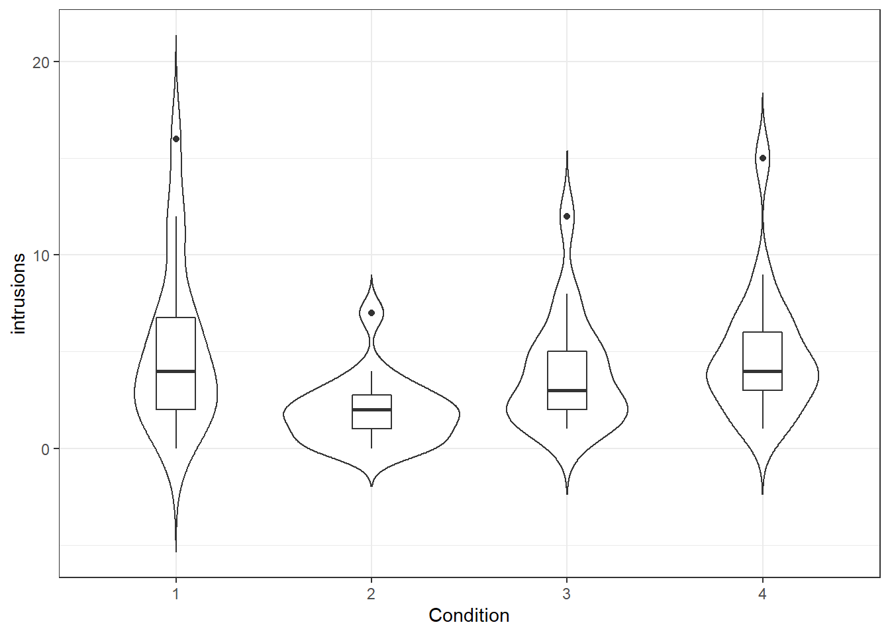
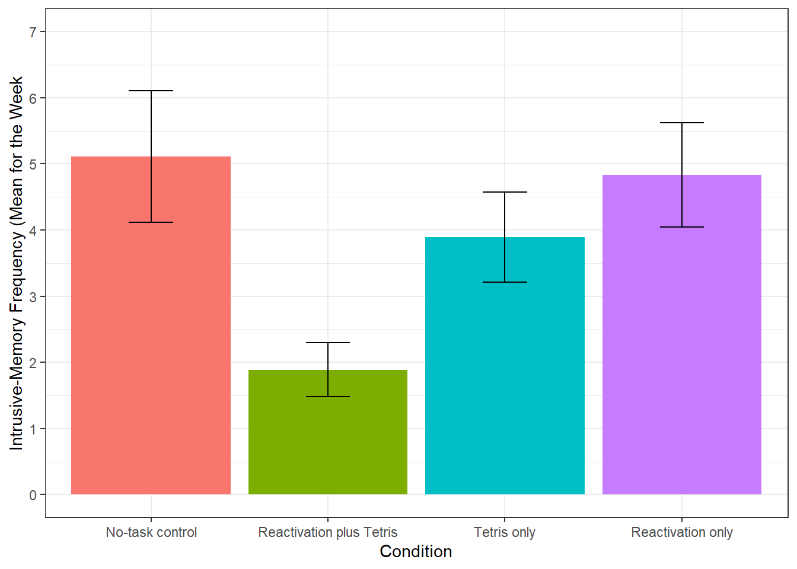

# One-way ANOVA

### Background: Intrusive memories

In the lecture we worked through calculating an ANOVA by hand in order to gain a conceptual understanding. However, when you run an ANOVA, typically the computer does all of these calculations for you. In this chapter we'll show you how to run a one-factor and factorial ANOVA using the `afex` package and post-hoc tests using a package called `emmeans`. 

In this example we will be using data from experiment 2 of [James, E. L., Bonsall, M. B., Hoppitt, L., Tunbridge, E. M., Geddes, J. R., Milton, A. L., & Holmes, E. A. (2015). Computer game play reduces intrusive memories of experimental trauma via reconsolidation-update mechanisms. Psychological Science, 26, 1201-1215](https://www.ncbi.nlm.nih.gov/pmc/articles/PMC4526368/).

The abstract for the paper is as follows:

> Memory of a traumatic event becomes consolidated within hours. Intrusive memories can then flash back repeatedly into the mind's eye and cause distress. We investigated whether reconsolidation - the process during which memories become malleable when recalled - can be blocked using a cognitive task and whether such an approach can reduce these unbidden intrusions. We predicted that reconsolidation of a reactivated visual memory of experimental trauma could be disrupted by engaging in a visuospatial task that would compete for visual working memory resources. We showed that intrusive memories were virtually abolished by playing the computer game Tetris following a memory-reactivation task 24 hr after initial exposure to experimental trauma. Furthermore, both memory reactivation and playing Tetris were required to reduce subsequent intrusions (Experiment 2), consistent with reconsolidation-update mechanisms. A simple, non-invasive cognitive-task procedure administered after emotional memory has already consolidated (i.e., > 24 hours after exposure to experimental trauma) may prevent the recurrence of intrusive memories of those emotional events.

### Activity 1: Set-up {#anova-a1}  

Do the following:

* Open R Studio and set the working directory to your chapter folder. Ensure the environment is clear.    
* Open a new R Markdown document and save it in your working directory. Call the file "One-way ANOVA".  
* Download <a href="James Holmes_Expt 2_DATA.csv" download>James Holmes_Expt 2_DATA.csv</a> and save it in your chapter folder.  
* If you're on the server, avoid a number of issues by restarting the session - click `Session` - `Restart R`   
* In a new code chunk, type and run the code that loads `pwr`, `lsr`, `car`, `broom`, `afex`, `emmeans`, `performance` and `tidyverse` using the `library()` function and loads the data into an object named `dat` using `read_csv()`. If you are working on your own machine you may need to install `afex` and `emmeans` but as always **do not install packages on university machines**.    
* Add (hint: mutate) a column to `dat` called `subject`that equals `row_number()` to act as a participant ID which is currently missing from the data set.  


### Activity 2: Data wrangling {#anova-a2}  

There are a lot of columns in this data set that we don't need for this analysis and the names of the variable are also long and difficult to work with. 

* Create a new object called `dat2` that just has the three columns we need - use `select()` to select the columns `subject`, `Condition`, and  `Days_One_to_Seven_Image_Based_Intrusions_in_Intrusion_Diary`
* Use `rename()` to rename `Days_One_to_Seven_Image_Based_Intrusions_in_Intrusion_Diary` to `intrusions`
* See if you can do this all in one pipeline
* Hint: `new_name = old_name`


### Activity 3: Numbers and factors {#anova-a3}

In addition to the names of the variables being too long, the levels of `Condition` are named 1,2,3,4 which R will think is a number rather than a category. We're going to overwrite the column `Condition` with a column that recodes these numbers as a factor. Copy and paste the code below into your Markdown and then run it.


```r
dat2 <- dat2 %>%
  mutate(Condition = as.factor(Condition))
```

**This is a really important step**. If you forget to recode variables as factors and R treats them as numbers, a lot of things won't work. Trust us, we've spent a lot of time trying to figure out what was wrong because we forgot to do this step!

### Activity 4: Create summary statistics {#anova-a4}

Next we want to calculate some descriptive statistics. We're really interested in the scores from each experimental group rather than overall.

* Create an object called `sum_dat`that contains the mean, standard deviation and standard error for the number of intrusions grouped by `Condition`  
* Use the pipe to achieve this in one pipeline  
* Your table should have four columns, `Condition`, `mean`, `sd`, and `se`.  


<div class='webex-solution'><button> Hint</button>


```
## 
## 
## * Use group_by(some_grouping_variable) %>% summarise(...)
## * standard error = sd/sqrt(n) =  sd/sqrt(length(some_variable_name)
```

</div>


### Activity 5: Visualisation {#anova-a5}

Now we can visualise the data. In the original paper they use a bar plot, which we will reproduce later but for now let's use a better plot that gives us more information about the data. 

* Create the below violin-boxplot with number of intrusions on the y-axis and condition on the x-axis (see the Visualisation chapter for more info). 
* Change the labels on the x-axis to something more informative (hint: `scale_x_discrete(labels = c("label names")`)  

<div class="figure" style="text-align: center">

<p class="caption">(\#fig:violin-plot)Number of intrusions by condition</p>
</div>

We can see from this plot that there are outliers in each of the groups. This information isn't present in the bar plot, which is why it's not a good idea to use them but we will reproduce it anyway.The below code shows you how to produce the bar plot that is presented in the paper. Try and figure out what each bit of code is doing in the plot (remember to use the help documentation for each function) and see what happens when you change the values for each argument.


```r
ggplot(sum_dat, aes(x = Condition, y = mean, fill = Condition))+
  stat_summary(fun = "mean", geom = "bar", show.legend = FALSE)+
  geom_errorbar(aes(ymin = mean - se, ymax = mean + se), width = 0.25)+
  scale_y_continuous(limits = c(0,7), 
                     breaks = c(0,1,2,3,4,5,6,7), 
                     name = "Intrusive-Memory Frequency (Mean for the Week")+
  scale_x_discrete(labels = c("No-task control", "Reactivation plus Tetris", "Tetris only",
                                "Reactivation only"))
```

<div class="figure" style="text-align: center">

<p class="caption">(\#fig:bar-plot)Bar plot of instrusions by condition</p>
</div>

### Activity 6: One-way ANOVA {#anova-a6}

Now we can run the one-way ANOVA using `aov_ez` from the `afex` package and save it to the object `mod`. As well as running the ANOVA, the `aov_ez` function also conducts a Levene's test for homogeneity of variance so that we can test our final assumption.

`aov_ez()` will likely produce some messages that look like errors, do not worry about these, they are just letting you know what it's done. 

* Copy and paste the below code to run and then view the results of the ANOVA using `anova(mod)`.


```r
mod <- aov_ez(id = "subject", # the column containing the subject IDs
              dv = "intrusions", # the DV 
              between = "Condition", # the between-subject variable
              es = "pes", # sets effect size to partial eta-squared
              type = 3, # this affects how the sum of squares is calculated, set this to 3
              include_aov = TRUE,
              data = dat2)

anova(mod)
```

Just like with the t-tests and correlations, we can use `tidy()` to make the output easier to work with.

* Run the below code to transform the output. Don't worry about the warning message, it is just telling you it doesn't know how to automatically rename the columns so it will keep the original names.


```r
mod_output <- (mod$anova_table) %>% tidy()
```

```
## Warning in tidy.anova(.): The following column names in ANOVA output were not
## recognized or transformed: num.Df, den.Df, MSE, ges
```

* `term` = the IV  
* `num.Df` = degrees of freedom effect
* `den.Df` = degrees of freedom residuals
* `MSE` = Mean-squared errors
* `statistic` = F-statistic
* `ges` = effect size  
* `p.value` = p.value

You should refer to the lecture for more information on what each variable means and how it is calculated.

* Is the overall effect of Condition significant? <select class='webex-select'><option value='blank'></option><option value='answer'>Yes</option><option value=''>No</option></select>
* What is the F-statistics to 2 decimal places? <input class='webex-solveme nospaces' size='4' data-answer='["3.79"]'/>
* According to the rules of thumb, the effect size is <select class='webex-select'><option value='blank'></option><option value=''>Small</option><option value=''>Medium</option><option value='answer'>Large</option></select>


### Activity 7: Assumption checking {#anova-a7}

You may be wondering why we haven't yet checked the assumptions. Well, unlike the t-tests and correlations, in order to test the assumptions we need to use the model we created with `aov_ez()`, so we couldn't assess them all until this point. For a one-way independent ANOVA, the assumptions are the same as for a Student's t-test:

1. The DV is interval or ratio data
2. The observations should be independent
3. The residuals should be normally distributed
4. There should be homogeneity of variance between the groups

We know that 1 and 2 are met because of the design of our study. To test 3, as we have done before we can look at the QQ-plot of the residuals and test for normality with the Shapiro-Wilk test. The residuals have been stored as one of the components of `mod`. To access them we specify `mod$aov$residuals`.


```r
qqPlot(mod$aov$residuals)
```

<div class="figure" style="text-align: center">

<p class="caption">(\#fig:fig-qq)qq-plot for model residuals</p>
</div>

```r
shapiro.test(mod$aov$residuals)
```

```
## [1] 11 60
## 
## 	Shapiro-Wilk normality test
## 
## data:  mod$aov$residuals
## W = 0.87739, p-value = 4.252e-06
```

There are a few things to note about the assumption test results. First, look at the p-value for the Shapiro-Wilk test - `4.252e-06`. Whenever you see the `e` at the end of a number it means that R is using **scientific notation**. Scientific notation is a way of writing very large or very small numbers. Because the number after the `e` is negative it means the number should be divided by 10 to the power of six. Put simply, move the decimal place six places to the left and you will get the standard number. When reporting p-values in your results section, you should not use scientific notation, instead you should round to 3 decimal places.

* What is the value of `4.252e-06`? <select class='webex-select'><option value='blank'></option><option value=''>.004252</option><option value=''>42.52</option><option value='answer'>.000004252</option></select>

If you want R to round this for you to make it easier to read, you could use the below code to save it to an object, tidy it and then round the p.value. Just remember that in APA style you should never write "p = 0", instead, you should write "p < .001" (because p will never equal actual zero, it can just be very, very, very small).


```r
shapiro <- shapiro.test(mod$aov$residuals) %>% #run the test
  tidy() %>% # tidy the output
  mutate(p.value = round(p.value, digits = 3)) # overwrite the p-value with one rounded to 3 decimal places
```

The second thing to note is that from both the qq-plot and the Shapiro-Wilk test it is clear that the assumption of normality has not been met. Is this a problem? Well, Field et al. (2009) say that if the sample sizes for each group are equal then ANOVA is robust to violations of both normality and of homogeneity of variance. There's also a good discussion of this [here](https://link.springer.com/article/10.3758/s13428-017-0918-2) but it is a bit technical. We can check how many participants are in each condition using `count()`:


```r
dat2 %>% count(Condition)
```


| Condition | n  |
|:---------:|:--:|
|     1     | 18 |
|     2     | 18 |
|     3     | 18 |
|     4     | 18 |

Thankfully the sample sizes are equal so we should be OK to proceed with the ANOVA. It is not clear whether normality was checked in the original paper.

For the last assumption, we can test homogeneity of variance with Levene's test and the function `test_levene()` from `afex`. The code for this is very simple, you just need to supply the ANOVA model we created earlier `mod`.


```r
test_levene(mod)
```

```
## Warning: Functionality has moved to the 'performance' package.
## Calling 'performance::check_homogeneity()'.
```

```
## Warning: Variances differ between groups (Levene's Test, p = 0.039).
```

The results from Levene's test show that the assumption of homogeneity of variance has also not been met. The paper does indicate this might be the case as it specifies that the ANOVAs do not assume equal variance, however, the results of the ANOVA that are reported are identical to our results above where no correction has been made although the post-hoc tests are Welch tests (you can tell this because the degrees of freedom have been adjusted and are not whole numbers).

Whilst all of this might seem very confusing - we imagine you might be wondering what the point of assumption testing is given that it seems to be ignored - we're showing you this for three reasons: 

1. To reassure you that sometimes the data can fail to meet the assumptions and it is still ok to use the test. To put this in statistical terms, many tests are **robust** to mild deviations of normality and unequal variance, particularly with equal sample sizes. 
2. As a critical thinking point, to remind you that just because a piece of research has been published does not mean it is perfect and you should always evaluate whether the methods used are appropriate. 
3. To reinforce the importance of pre-registration where these decisions could be made in advance, and/or open data and code so that analyses can be reproduced exactly to avoid any ambiguity about exactly what was done. In this example, given the equal sample sizes and the difference in variance between the groups isn't too extreme, it looks like it is still  appropriate to use an ANOVA but the decisions and justification for those decisions could have been more transparent.


### Activity 8: Post-hoc tests {#anova-a8}

For post-hoc comparisons, as mentioned, the paper appears to have computed Welch t-tests but there is no mention of any multiple comparison correction. We could reproduce these results by using `t.test` for each of the contrasts.

For example, to compare condition 1 (the control group) with condition 2 (the reactivation plus tetris group) we could run:


```r
dat2 %>%
  filter(Condition %in% c("1", "2")) %>%
  droplevels() %>% 
  t.test(intrusions ~ Condition, data = .)
```

<div class="info">
<p>Because <code>Condition</code> has four levels, we can’t just specify <code>intrustion ~ Condition</code> because a t-test compares two groups and it wouldn’t know which of the four to compare so first we have to filter the data and use a new function <code>droplevels()</code>. It's important to remember that when it comes to R there are two things to consider, the data you can see and the underlying structure of that data. In the above code we use <code>filter()</code> to select only conditions 1 and 2 so that we can compare them. However, that doesn't change the fact that R "knows" that <code>Condition</code> has four levels - it doesn't matter if two of those levels don't have any observations any more, the underlying structure still says there are four groups. <code>droplevels()</code> tells R to remove any unused levels from a factor. Try running the above code but without <code>droplevels()</code> and see what happens.</p>
</div>

However, a quicker and better way of doing this that allows you apply a correction for multiple comparisons easily is to use `emmeans()` which computes all possible pairwise comparison t-tests and applies a correction to the p-value. 

First, we use `emmeans()` to run the comparisons and then we can pull out the contrasts and use `tidy()` to make it easier to work with.

* Run the code below. Which conditions are significantly different from each other? Are any of the comparisons different from the ones reported in the paper now that a correction for multiple comparisons has been applied?


```r
mod_pairwise <-emmeans(mod, pairwise ~ Condition, adjust = "bonferroni")
mod_contrasts <- mod_pairwise$contrasts %>% tidy()
```

<div class="warning">
<p>The inquisitive amongst you may have noticed that <code>mod</code> is a list of 5 and seemingly contains the same thing three times: <code>anova_table</code>, <code>aov</code> and <code>Anova</code>. The reasons behind the differences are too complex to go into detail on this course (see <a href="https://rcompanion.org/rcompanion/d_04.html">here</a> for more info) but the simple version is that <code>anova_table</code> and <code>Anova</code>use one method of calculating the results (type 3 sum of squares) and <code>aov</code> uses a different method (type 1 sum of squares). What's important for your purposes is that you need to use <code>anova_table</code> to view the overall results (and replicate the results from papers) and <code>aov</code>to run the follow-up tests and to get access to the residuals (or <code>lm()</code> for factorial ANOVA). As always, precision and attention to detail is key.</p>
</div>

### Activity 9: Power and effect size {#anova-a9}

Finally, we can replicate their power analysis using `pwr.anova.test`.

> On the basis of the effect size of d = 1.14 from Experiment 1, we assumed a large effect size of f = 0.4. A sample size of 18 per condition was required in order to ensure an 80% power to detect this difference at the 5% significance level.


```r
pwr.anova.test(k = 4, f = .4, sig.level = .05, power = .8)
```

```
## 
##      Balanced one-way analysis of variance power calculation 
## 
##               k = 4
##               n = 18.04262
##               f = 0.4
##       sig.level = 0.05
##           power = 0.8
## 
## NOTE: n is number in each group
```

We've already got the effect size for the overall ANOVA, however, we should also really calculate Cohen's D using `cohensD` from `lsr` for each of the pairwise comparisons. This code is a little complicated because you need to do it separately for each comparison, bind them all together and then add them to `mod_contrasts` - just make sure your understand which bits of the code you would need to change to run this on different data.


```r
d_1_2 <- cohensD(intrusions ~ Condition, 
                 data = filter(dat2, Condition %in% c(1,2)) %>% 
                   droplevels())

d_1_3 <- cohensD(intrusions ~ Condition, 
                 data = filter(dat2, Condition %in% c(1,3)) %>%
                   droplevels()) 

d_1_4 <- cohensD(intrusions ~ Condition, 
                 data = filter(dat2, Condition %in% c(1,4)) %>%
                   droplevels())

d_2_3 <- cohensD(intrusions ~ Condition, 
                 data = filter(dat2, Condition %in% c(2,3)) %>% 
                   droplevels())

d_2_4 <- cohensD(intrusions ~ Condition, 
                 data = filter(dat2, Condition %in% c(2,4)) %>% 
                   droplevels())

d_3_4 <- cohensD(intrusions ~ Condition, 
                 data = filter(dat2, Condition %in% c(3,4)) %>%
                   droplevels())

pairwise_ds <- c(d_1_2,d_1_3,d_1_4,d_2_3,d_2_4,d_3_4)

mod_contrasts <- mod_contrasts %>%
  mutate(eff_size = pairwise_ds)
```


<div class="warning">
<p>What are your options if the data don't meet the assumptions and it's really not appropriate to continue with a regular one-way ANOVA? As always, there are multiple options and it is a judgement call.</p>
<ol style="list-style-type: decimal">
<li>You could run a non-parametric test, the Kruskal-Wallis for between-subject designs and the Friedman test for within-subject designs.</li>
<li>If normality is the problem, you could try transforming the data. Field et al. (2009) has a good section on data transformation.</li>
<li>You could use bootstrapping, which is not something we will cover in this course at all. Again, Field et al. (2009) covers this although it is a little complicated.</li>
</ol>
</div>

### Activity 10: Write-up {#anova-a10}

The below code replicates the write-up in the paper, although has changed the Welch t-test to the pairwise comparisons from `emmeans`.


```r
Second, and critically, for the 7-day diary postintervention, there was a significant difference between groups in overall intrusion frequency in daily life, F(`r mod_output$num.Df`, `r mod_output$den.Df`) = `r mod_output$statistic %>% round(2)`, p = `r mod_output$p.value %>% round(3)`, ηp2 = .`r mod_output$ges %>% round(2)`. Planned comparisons demonstrated that relative to the no-task control group, only those in the reactivation-plus-Tetris group, t(`r mod_contrasts$df[1]`) = `r mod_contrasts$statistic[1] %>% round(2)`, p = `r mod_contrasts$adj.p.value[1] %>% round(2)`, d = `r mod_contrasts$eff_size[1] %>% round(2)`, experienced significantly fewer intrusive memories; this finding replicated Experiment 1. The reactivation-plus-Tetris group had significantly fewer intrusive thoughts than the reactivation-only group, t(`r mod_contrasts$df[5]`) = `r mod_contrasts$statistic[5] %>% round(2)`, p = `r mod_contrasts$adj.p.value[5] %>% round(2)`, d = `r mod_contrasts$eff_size[5] %>% round(2)`. Further, there were no significant differences between the reactivation-plus-Tetris group and the Tetris-only group, t(`r mod_contrasts$df[4]`) = `r mod_contrasts$statistic[4] %>% round(2)`, p = `r mod_contrasts$adj.p.value[4] %>% round(2)`, d = `r mod_contrasts$eff_size[4] %>% round(2)`, the no-task control group and the reactivation-only group, t(`r mod_contrasts$df[3]`) = `r mod_contrasts$statistic[3] %>% round(2)`, p = `r mod_contrasts$adj.p.value[3] %>% round(2)`, or between the no-task control group and the Tetris-only group, t(`r mod_contrasts$df[2]`) = `r mod_contrasts$statistic[2] %>% round(2)`, p = `r mod_contrasts$adj.p.value[2] %>% round(2)`
```

Second, and critically, for the 7-day diary postintervention, there was a significant difference between groups in overall intrusion frequency in daily life, F(3, 68) = 3.79, p = 0.014, ηp2 = .0.14. Planned comparisons demonstrated that relative to the no-task control group, only those in the reactivation-plus-Tetris group, t(68) = 3.04, p = 0.02, d = 1, experienced significantly fewer intrusive memories; this finding replicated Experiment 1. Critically, as predicted by reconsolidation theory, the reactivation-plus-Tetris group had significantly fewer intrusive memories than the Tetris-only group, t(68) = -1.89, p = 0.38, d = 0.84, as well as the reactivation-only group, t(68) = -2.78, p = 0.04, d = 1.11. Further, there were no significant differences between the no-task control group and the reactivation-only group, t(68) = 0.26, p = 1, or between the no-task control group and the Tetris-only group, t(68) = 1.15, p = 1

### Activity solutions {#anova-sols}

Below this line you will find the solutions to the above tasks. Only look at them after giving the tasks a good try yourself!

#### Activity 1 {#anova-1sol}


<div class='webex-solution'><button>Solution</button>


```r
library("pwr")
library("lsr")
library("car")
library("broom")
library("afex")
library("emmeans")
libr\ry("performance")
library("tidyverse")

dat <- read_csv("James Holmes_Expt 2_DATA.csv")%>%
  mutate(subject = row_number())
```

</div>


** Click tab to see solution **

#### Activity 2 {#anova-a2sol}


<div class='webex-solution'><button>Solution</button>


```r
dat2 <- dat%>%
  select(subject,Condition,Days_One_to_Seven_Image_Based_Intrusions_in_Intrusion_Diary)%>%
  rename(intrusions = Days_One_to_Seven_Image_Based_Intrusions_in_Intrusion_Diary)
```

</div>


** Click tab to see solution **


#### Activity 4 {#anova-a4sol}


<div class='webex-solution'><button>Solution</button>


```r
sum_dat<-dat2%>%
  group_by(Condition)%>%
  summarise(mean = mean(intrusions),
            sd = sd(intrusions),
            se = sd/sqrt(length(intrusions)))
```

</div>


** Click tab to see solution **

#### Activity 5 {#anova-a5sol}


<div class='webex-solution'><button>Solution</button>


```r
ggplot(dat2, aes(x = Condition, y = intrusions))+
  geom_violin(trim = FALSE)+
  geom_boxplot(width = .2)
```

</div>


** Click tab to see solution **
